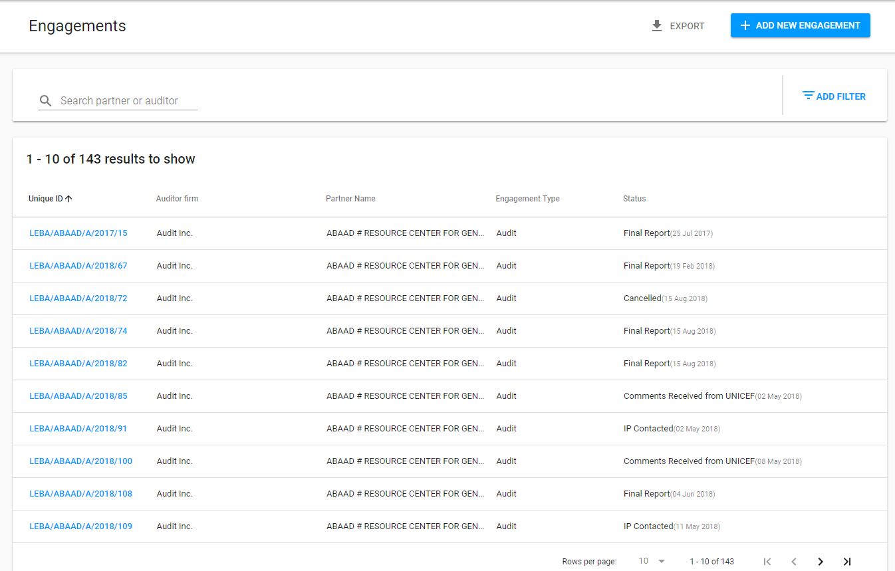
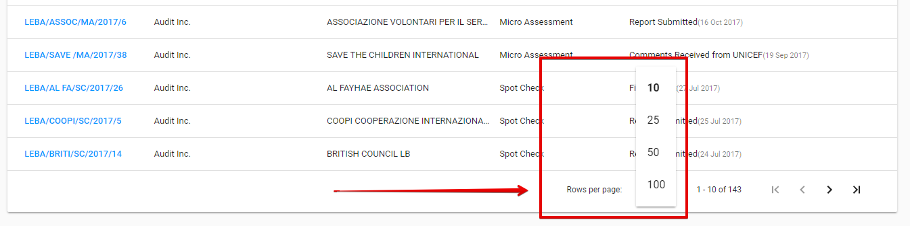
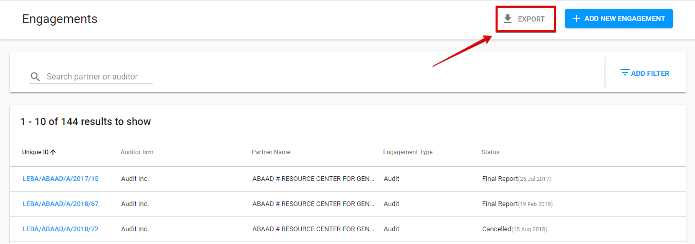
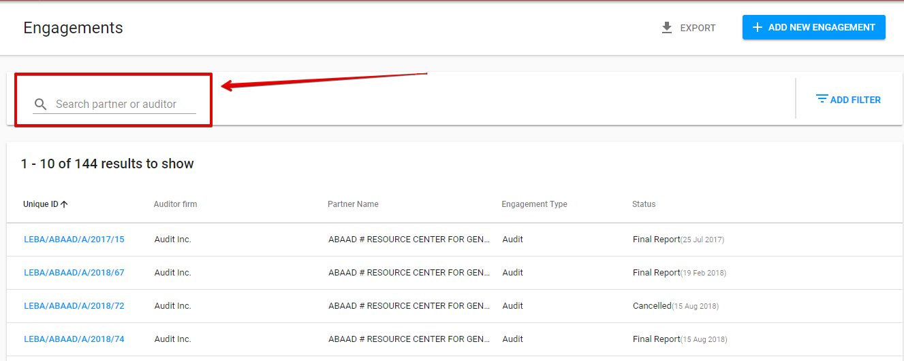
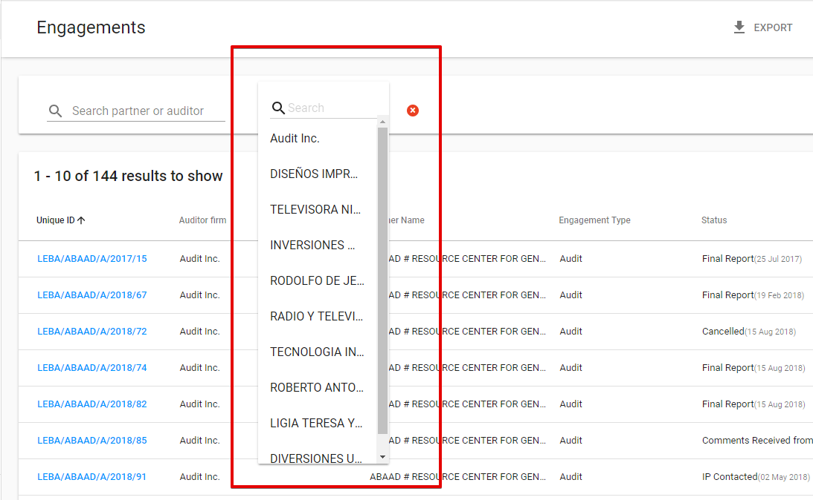

# Engagements section

This section provides the step-by-step description of the creation, assignment, reporting, approving, tracking and finalization of the Engagements.

List of Engagements is the main element on this page. It contains the Engagements of all types and statuses. Here is the overall UI:

User can **sort columns** in either ascending or descending order.

User can choose the **number of the displayed Engagements per page**, it can be selected in the following dropdown field \(the default value is 10 rows per page\):

Clicking the reference number for each row will take user to the corresponding **Engagements Details**.

## Export

List of Engagements can be exported to **CSV** file using the "Export" button in the upper right-hand corner.

## Searching

User can search through the Engagements, and the search can be perfomed for Partner name or Auditor fields.

## Filtering

In the upper right-hand corner the user can use "Add filter" option with set of parameters to be chosen.

List can be filtered using the different kinds of filters: Auditor, Engagement Type, Partner, Status, Joint Audit. 

After the user selects the required filter from the Filters list, field with the droprown list of options and search fuction appears on the left side:

 **Example:** Filter “Auditor“ is selected:

