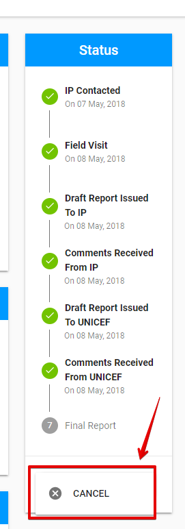
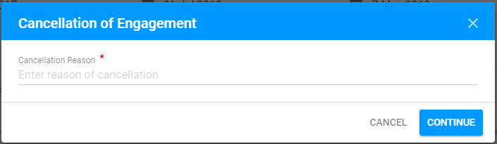
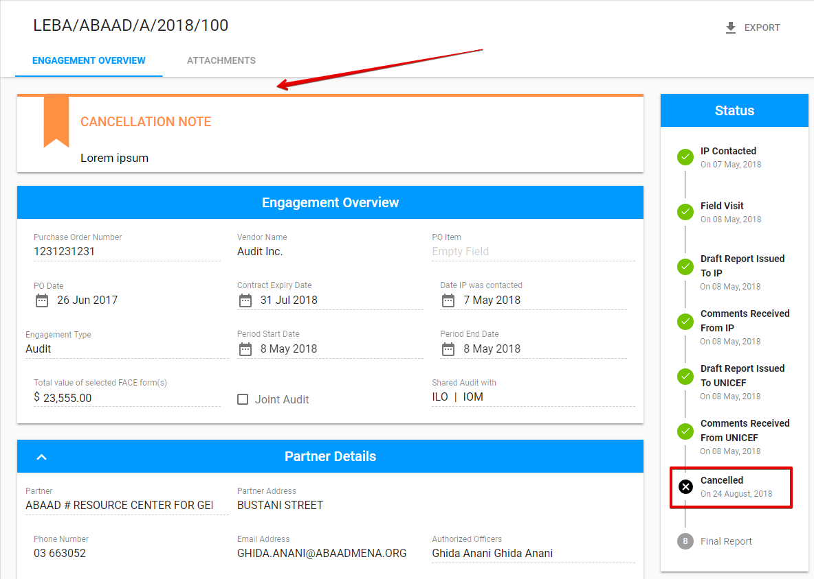

# Cancellation of Engagement

User can **Cancel** the Engagement via **"Cancel"** button. The "Cancel" option can be found in the drop-down list of the split button **"Save".**  

The user have to fill in **Cancellation Reason** in the following modal window opened after clicking the "Cancel" button:

Cancelled Engagement is marked with the cancellation note in the top of the screen. The status is changed to **"Cancelled"**. 


After the Engagement status became "Cancelled", the Report is not available for submission.


