# Reporting of Engagement


Reporting of the Engagement is availible for the **Auditor** users. 


After the user gets the access to the particular engagement, the Report can be filled in.

Screen for the created Engagement has 3 tabs:

* Engagement Overview tab
* Report tab
* Attachments tab

## **Engagement Overview** tab

In the **Engagement Overview** tab user can see all the information that was provided during the Engagement creation. Here is the overall UI for this tab:

## Report tab

Report tab will have different sections depending on the Engagement type. See the detailed descriprion of the Report for each Engagement type below \(click on each tab to open the descriprion\):



In case of the **Audit Engagement type**, the Report tab looks like following:

Here Auditor need to fill in these sections:

* Engagement status
* Summary of Audit Findings
* Financial Findings
* Assessment of Key Internal Controls

### Engagement status

This section is the common part of the Report tab for all Engagement types 

Each field in this section represents the Audit status. So, as the Auditor fills the dates, Engagement status is changing:

### Summary of Audit Findings

Auditor can change the information in this section using the "Edit" button at the end of each row \( "Edit" button appears after user hover the mouse over the particular line from the Summary of Audit Findings list\).

Editable data is available in the following modal window: 


The fields with dashed line are non-editable and filled in after the data in the **Financial Findings** and **Key Internal Control Weaknesses** sections is entered.


### Financial Findings

The new finding can be added via "+" button in the upper right-hand corner of the section: 

Auditor can add New Finding using the following modal window:

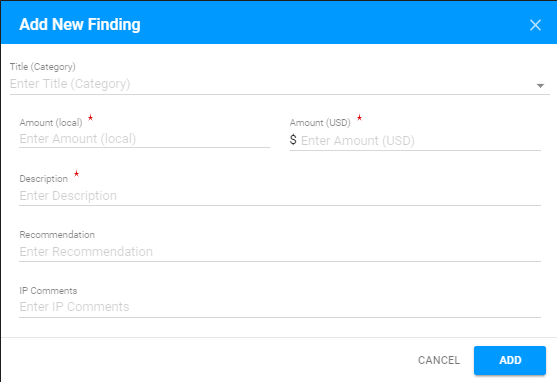

Each row can be expanded via the arrow to open the additional details:

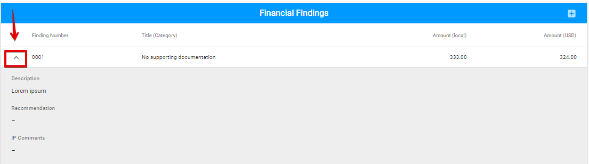

Each Finding can be edited or deleted via the "Edit" or "Delete" button accordingly \( "Edit" and "Delete" buttons appear after user hover the mouse over the particular line from the Financial Findings list\): 

### Assessment of Key Internal Controls

  
Auditor can add new Assessment using the following modal window, that can be opened via "+" button: 

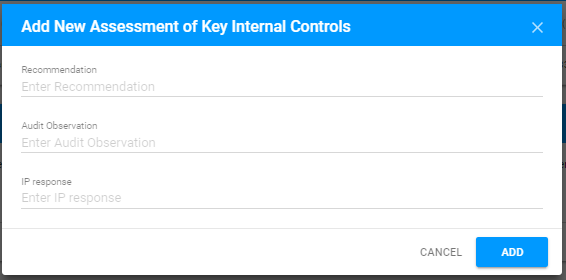

Each row is expandable and has "Edit" and "Delete" options \(corresponding buttons became visibe when user hover the mouse over the particular line\).

### Key Internal Control Weaknesses

Key Internal Control Weaknesses section consists of the expandable rows describing the particular weakness. 

  
The New risk for each row can be added by "+" button:

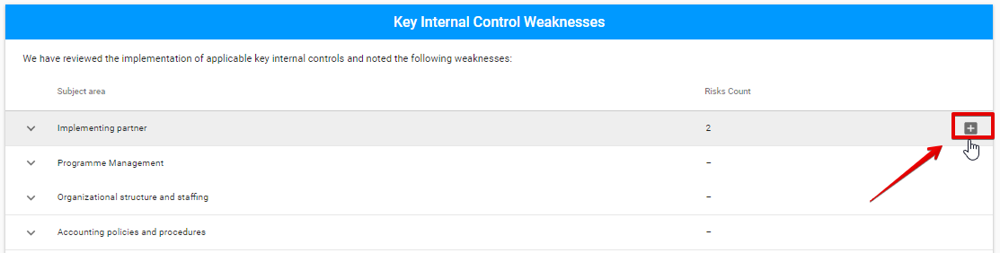

  
Adding new Risk is available in the following modal window: 

  
Each risk can be edited or deleted via "Edit" ****or "Delete" ****button accordingly \("Edit" and "Delete" buttons appear after user hover the mouse over the particular line of Key Internal Control Weaknesses details\):




In case of the **MA Engagement type**, the Report tab looks like the following:

Report tab for MA has the following sections:

* Engagement status section \(the detailed information see here\)
* Overall Risk Assessment
* Tested Subject Areas
* Detailed Internal Control Findings and Recommendations

### Engagement status

This section is the common part of the Report tab for all Engagement types 

Each field in this section represents the Audit status. So, as the Auditor fills the dates, Engagement status is changing:

### Overall Risk Assessment

  
Here is overall user interface of this section:​

### Tested Subject Areas

  
Tested Subject Areas section consists of the expandable rows that describe the particular area.​

Each row can be edited via "Edit" button \("Edit" button appears after user hover the mouse over the particular line from the Tested Subject Areas list\):

After User clicks on this button, the following modal window appears:

### Detailed Internal Control Findings and Recommendations

This section consist of the expandable rows that describe the particular Findings:

Auditor can add new findings using the "+" button:

After user clicks on this button, the following modal window appears:

Each row can be edited or deleted via "Edit" and "Delete" buttons correspondingly \("Edit" and "Delete" buttons appear after user hover the mouse over the particular line from the Findings list\):

###  **Questionnaire** tab

  
Micro Assessment Engagement has the additional **Questionnaire** tab that needs to be filled in before the Submission of the Report. 

Questionnaire is the list of questions, divided by sections:

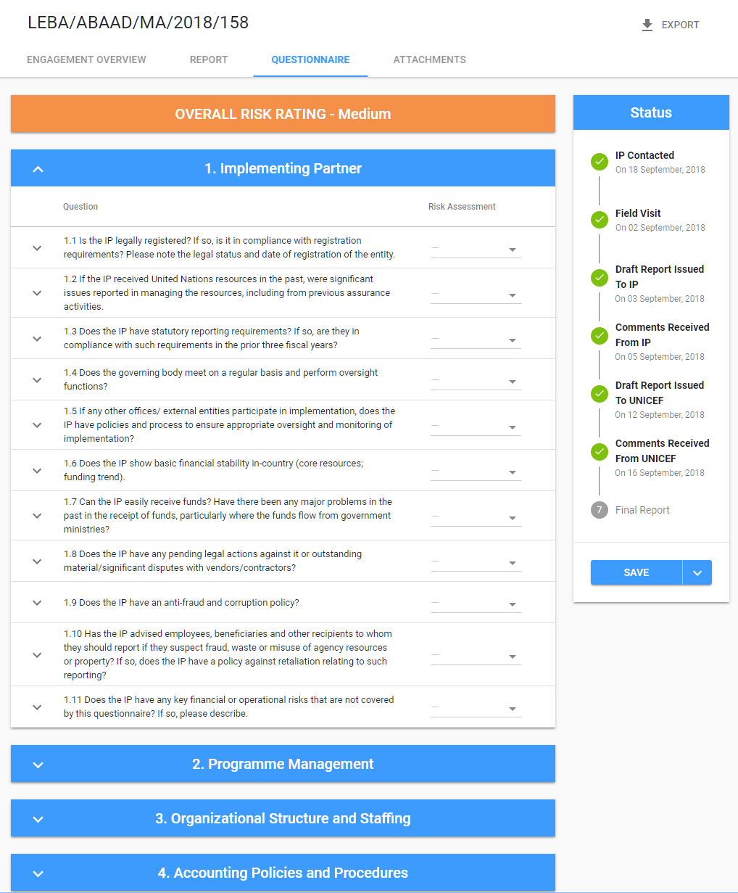

There are 7 sections and each section has different number of questions. Auditor has to estimate the Risk Assessment for each question. It can be done by using the dropdown fields that are placed on the right side of every question:

Each section of questions and each question can be expandede via the arrow buttont at the left hand corner of the rows. Auditor can use the "Edit" button at the right side of each question \(appears by mouse hover on the line\) to write mode details on the specific question:

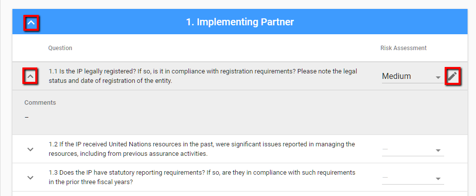

 After the user clicks on this button, the following modal window appears:




In case of the **SC Engagement type**, the Report tab looks like the following:

The Report tab for **Spot Check** has the following sections:

* Engagement Status
* Overview
* Summary of High Priority Findings and Recommendations
* Summary of Low Priority Findings and Recommendations
* Internal Controls

### Engagement status

This section is the common part of the Report tab for all Engagement types 

Each field in this section represents the Audit status. So, as the Auditor fills the dates, Engagement status is changing:

### Overview

### Summary of High Priority Findings and Recommendations

The section consists of the expandable rows that describe the particular finding:

User can add New Finding via the "+" button in the upper right-hand corner: 

After Auditor clicks on this button, the following modal window appears:

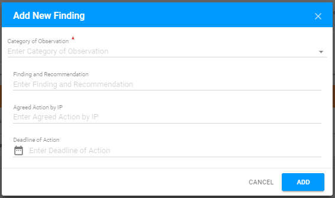

Each row can be edited or deleted via the "Edit" or "Delete" buttons correspondingly \("Edit" and "Delete" buttons appear after user hover the mouse over the particular line from the Findings list\):

### Summary of Low Priority Findings and Recommendations

This section has the same design as the section described earlier.

Here is the overall user interface: 

User can add New Finding is available via "+" button:

  
After Auditor clicks on this button, the following modal window appears:

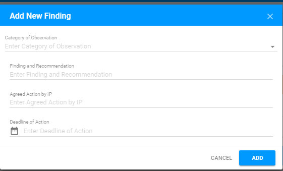

Each row can be edited or deleted via the "Edit" or "Delete" button correspondingly \("Edit" and "Delete" buttons appear after user hover the mouse over the particular line from the Findings list\): 

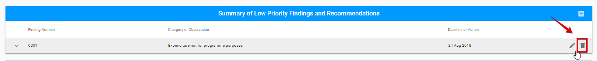

### Internal Controls

In this section Auditor can document information regarding the Internal Controls: 




In case of the **Special Audit Engagement type**, the Report tab looks like the following:

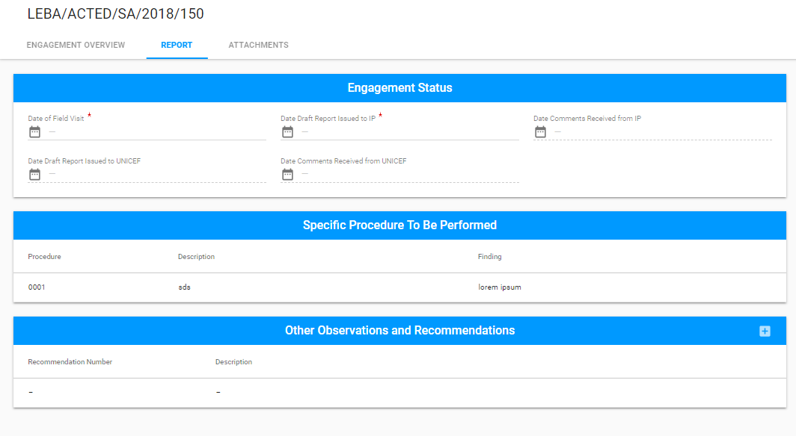

The Report tab for **Special Audit**  has the following sections:

* Engagement status 
* Specific Procedure to be Performed
* Other Observations and Recommendations

### Engagement status

This section is the common part of the Report tab for all Engagement types 

Each field in this section represents the Audit status. So, as the Auditor fills the dates, Engagement status is changing:

### Specific Procedure to be Performed

User can edit this section via "Edit" button at the end of each row \("Edit" button appears after user hover the mouse over the particular line from the Specific Procedures To Be Performed list\): 

  
After Auditor clicks on this button, the following modal window appears:

### Other Observations and Recommendations

Auditor can add New Recommendation  via "+" button: 

User can edit or delete the existing Recommendation via "Edit" and "Delete" buttons correspondingly \("Edit" and "Delete" buttons appear after user hover the mouse over the particular line from the Other Observations and Recommendations list\):




## Attachments

Auditor can attach all required files using the **Attachments** tab. Here is the overall UI of this tab:

Attachments tab has two sections:

* Related Documents
* Report Attachments

Auditor can download files from the Related Documents section. 

**Report Attachments** section is the section where Auditor should upload all requred Report files. 

The Report can be attached using the "+" button in the upper right-hand corner:

After the Auditor clicks on this button, the following modal window appears:

Attached files can be edited or deleted via "Edit" and "Delete" buttons correspondingly \("Edit" and "Delete" buttons appear after user hover the mouse over the particular line from the Attachments list\):

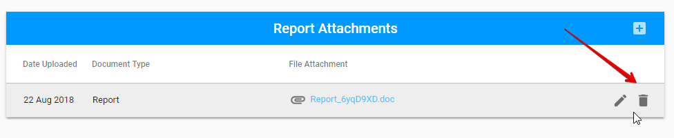

## Save changes

Changes can be saved via the split button "Save" at the bottom of Status panel.

  
Auditor can fill in or change the Report up until the Engagement status is **"Report submitted"**.

## **Email notification**

UNICEF Focal Point receives the following email right after the Report was submitted:

## **Export** 

Auditor can **Export** the Engagement to the **PDF** or **CSV** file via the "Export" button in the upper right-hand corner.

