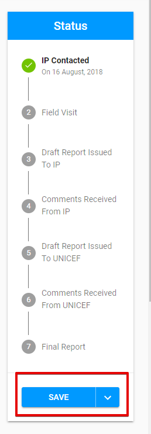
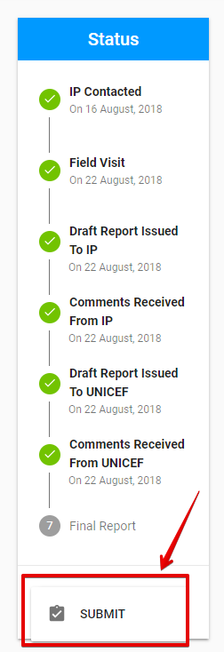
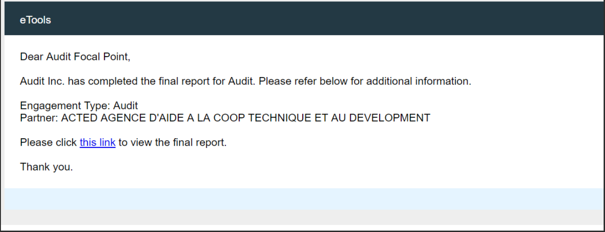
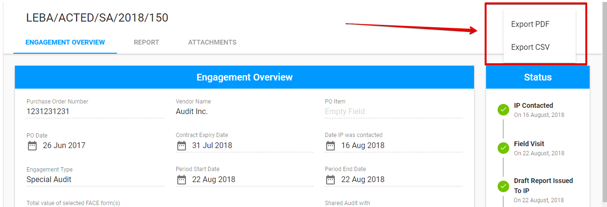

# Reporting of Engagement

After the user \(**Auditor**\) gets the access to the particular engagement, the Report can be filled in.


Auditor can fill in or change the Report up until the Engagement status is **"Report submitted"**. 



For **Canceled** Engagement the Report is not available.


Screen for the created Engagement has 3 tabs:

* Engagement Overview tab
* Report tab
* Attachments tab

~~You can find more details about the editable fields for all engagement types in the following articles:~~ [~~Editable tabs for all Engagement types~~ ](editable-tabs-for-all-engagements-types.md)~~and~~ [~~Editable tabs for each Engagement type~~](editable-tabs-for-each-engagement-type/)~~.~~

## Save changes

Changes can be saved via the split button "Save" at the bottom of Status panel.

## Submit Report

Submitting is available after all required information is entered and the report document is attached in the Attachments tab.

"Submit" option can be in the drop-down list of the "Save" split button.  

## **Email notification**

UNICEF Focal Point receives the following email right after the Report was submitted:

## **Export** 

Auditor can **export** the engagement to the **PDF** or **CSV** file via the "Export" button in the upper right-hand corner.

