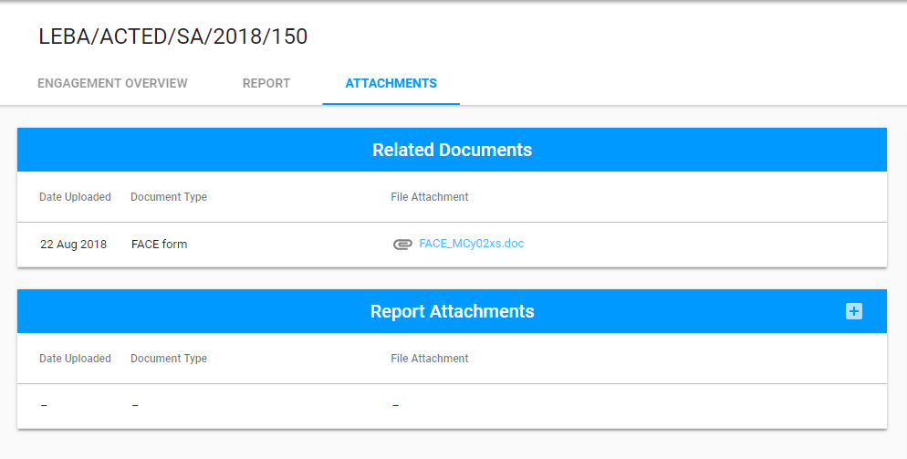
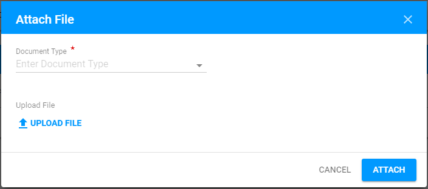
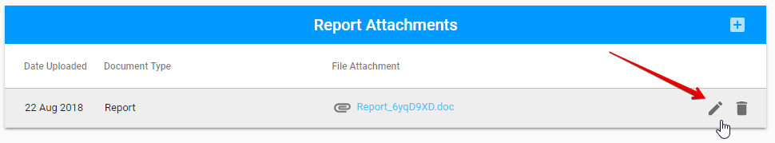

# Attachments

Auditor can attach all required files using the **Attachments** tab. Here is the overall user interface of this tab:

Attachments tab has two sections:

* Related Documents
* Report Attachments

Auditor can download files from the Related Documents section. 

**Report Attachments** section is the section where Auditor should upload all requred Report files. 

The Report can be attached using the "+" button in the upper right-hand corner:

After the Auditor clicks on this button, the following modal window appears:

Attached files can be edited or deleted via "Edit" and "Delete" buttons correspondingly:

