# Report for Audit

In case of the Audit Engagement type, the Report tab looks like following:

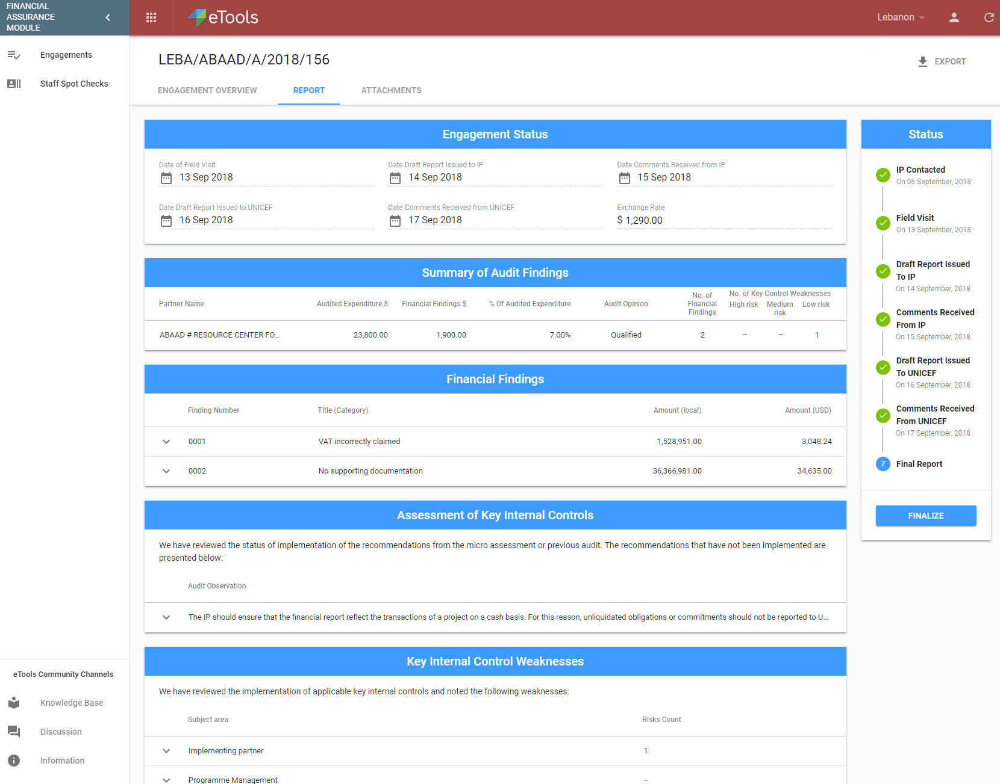

Here Auditor will need to fill in these sections:

* Engagement status
* Summary of Audit Findings
* Financial Findings
* Assessment of Key Internal Controls

## Engagement status

This section is the common part of the Report tab for all Engagement types 

Each field in this section represents the Audit status. So, as the Auditor fills the dates, Engagement status is changing:

## Summary of Audit Findings

Auditor can change the information in this section using the "Edit" button at the end of each row.

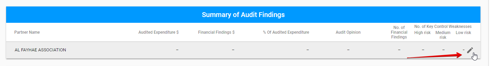

Editable data is available in the following modal window: 

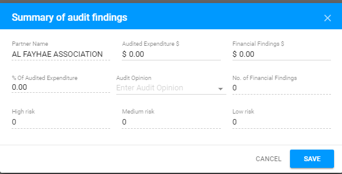


The fields with dashed line are non-editable and filled in after the data in the **Financial Findings** and **Key Internal Control Weaknesses** sections is entered.


## Financial Findings

The new finding can be added via "+" button in the upper right-hand corner of the section: 

Auditor can add New Finding using the following modal window:

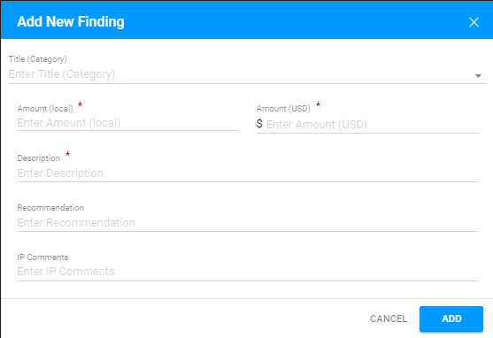

Each row can be expanded via the arrow to open the additional details:

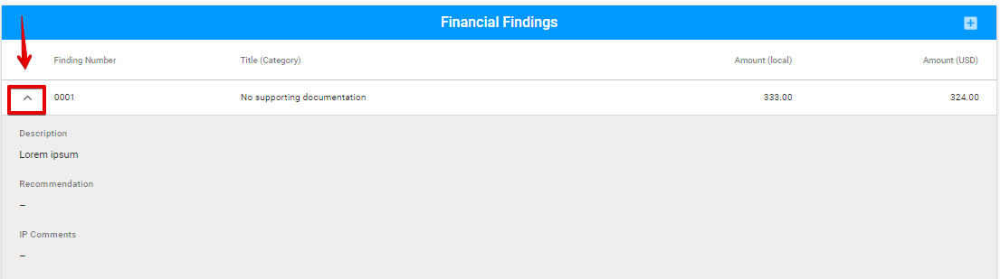

Each Finding can be edited or deleted via the "Edit" or "Delete" button accordingly. 

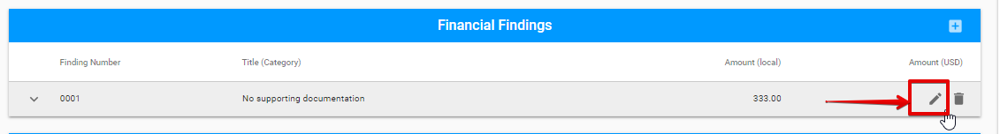

## Assessment of Key Internal Controls

  
Auditor can add new Assessment using the following modal window, that can be opened via "+" button: 

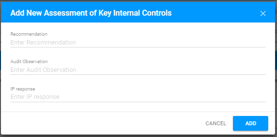

Each row is expandable and has "Edit" and "Delete" options.

## Key Internal Control Weaknesses

Key Internal Control Weaknesses section consists of the expandable rows describing the particular weakness. 

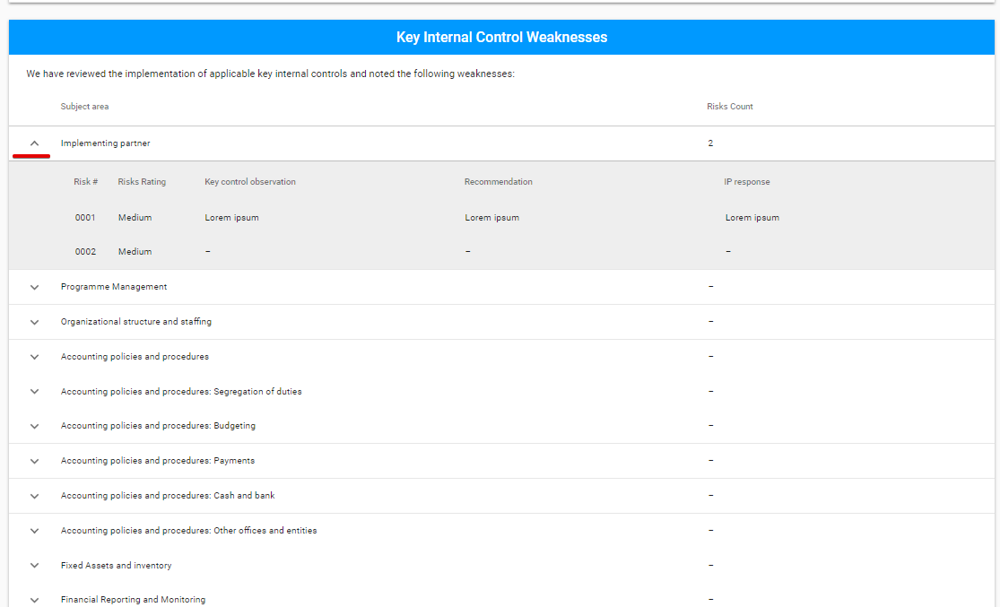

  
The New risk for each row can be added by "+" button:

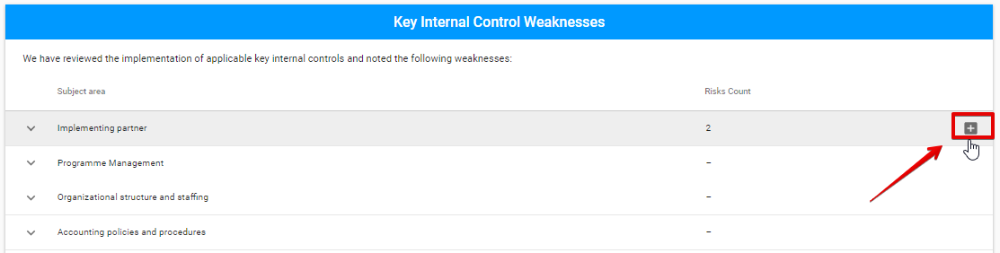

  
Adding new Risk is available in the following modal window: 

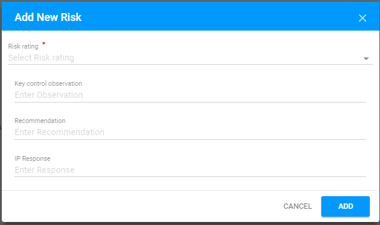

  
Each risk can be edited or deleted via "Edit" ****or "Delete" ****button accordingly:

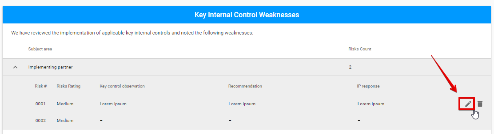

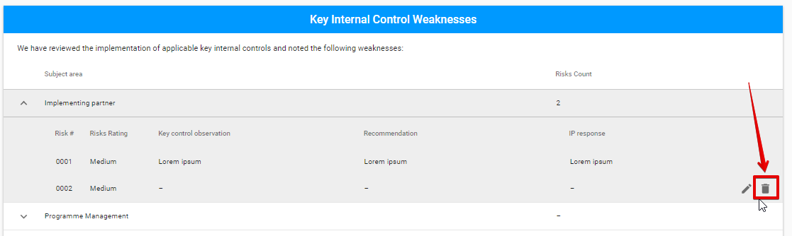

