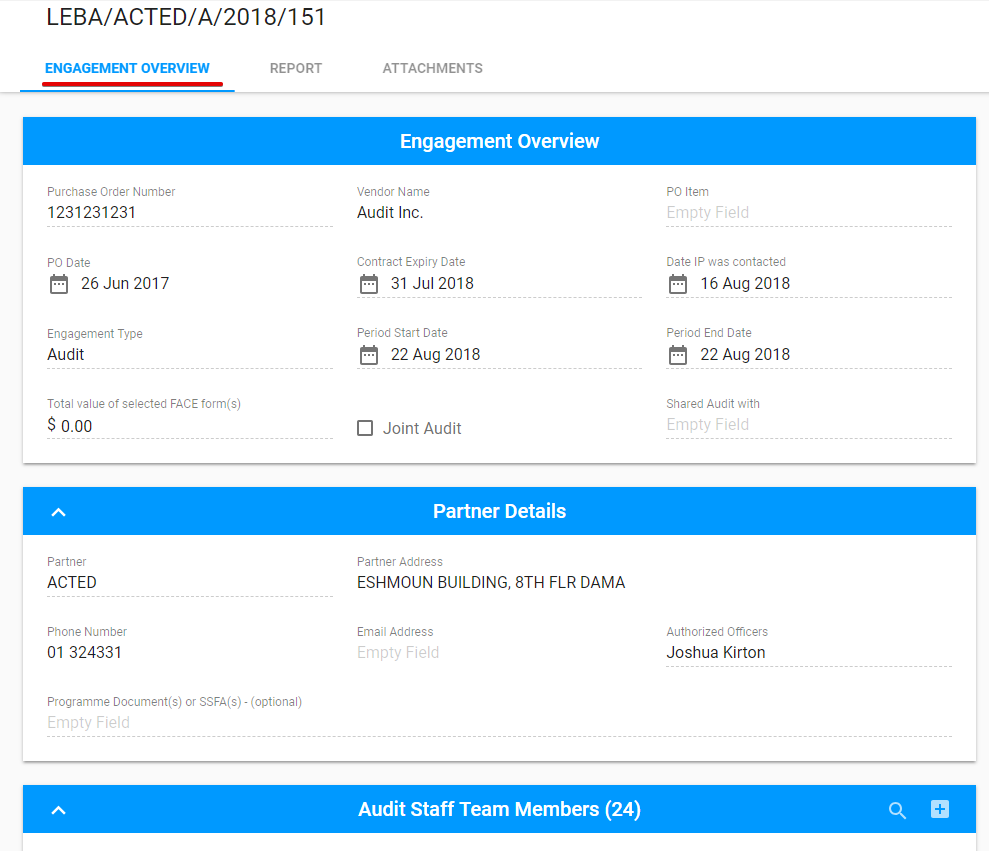
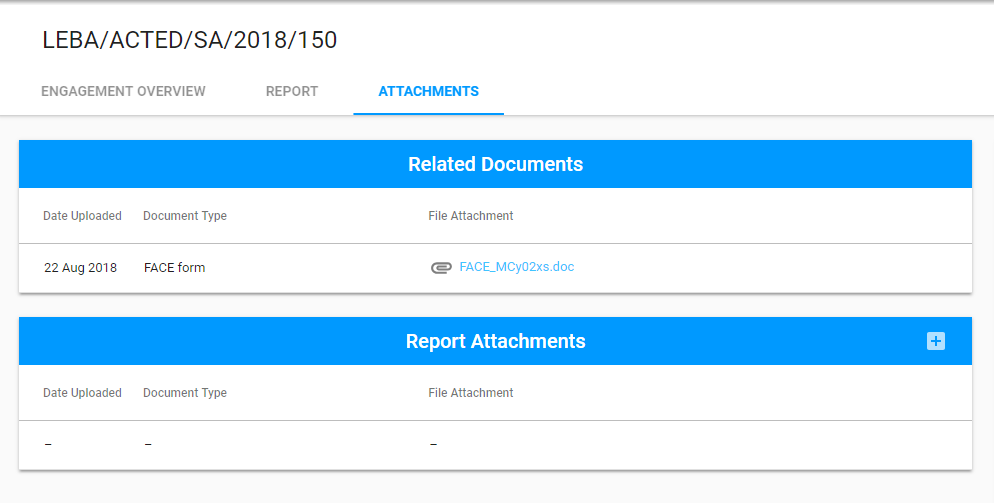
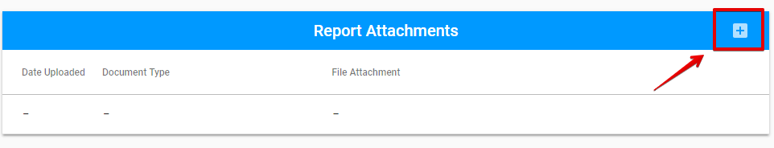
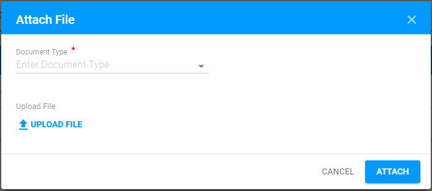
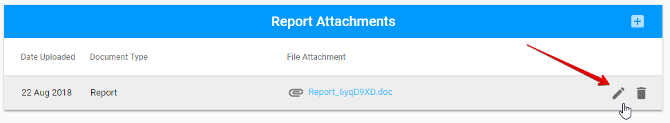
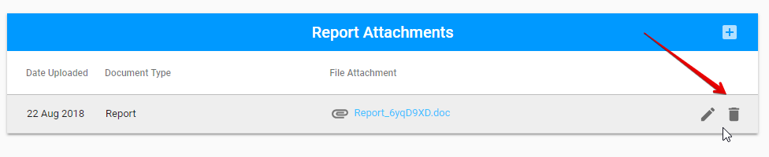

# Editable tabs for all Engagement types

Screen for the created Engagement has 4 sections:

* Engagement Overview tab
* Report tab
* Attachments tab
* Status panel \(the detailed information can be found [here](../how-to-add-new-engagement.md)\) 

Here are the **common** parts for each type of Engagements and the editable sections for them:



Here is the overall user interface for Engagement Overview tab:

The detailed information of this tab can be find [here](../how-to-add-new-engagement.md). 

### Editable section:

* **Audit Staff Team Members** section.

See more information about this section[ here](../how-to-add-new-engagement.md). 




The **UNICEFF Focal Point** has access to the Report tab when the **Auditor** submits the report.


**Engagement Status section** is the ****common part  **of the Report tab** for each type of Engagement.

Filling in the fields for dates leads to Status changing in the status panel. 

The other parts of Report tab is described [here](editable-tabs-for-each-engagement-type/) in according with the Engagement type. 



Here is the overall user interface for Attachments tab:

The detailed information of the Related Documents section can be find [here](../how-to-add-new-engagement.md).

### Editable section:

* **Report Attachments** section

The Report can be attached by **"+"** button in the upper, right-hand corner: 

The following modal window is opened after the "+" button is clicked:

Attached files can be edited or deleted via "Edit" and "Delete" button accordingly:




## 

