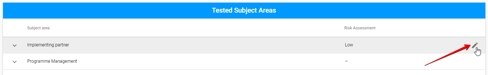
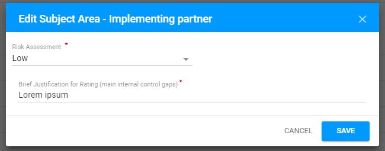
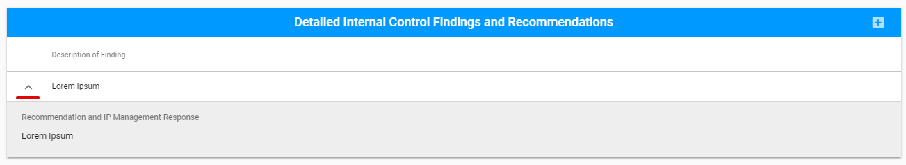
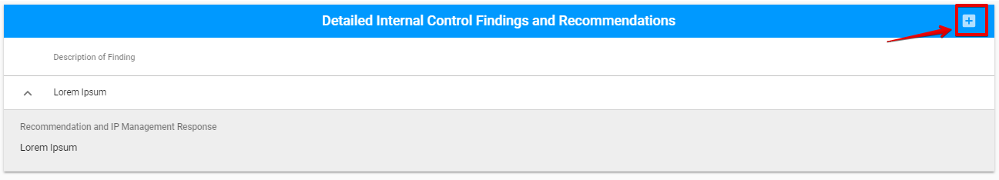
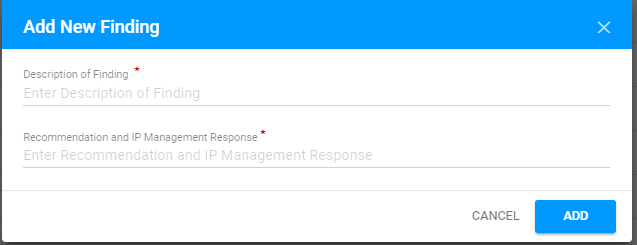
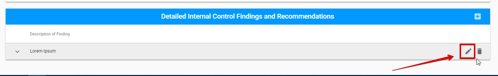
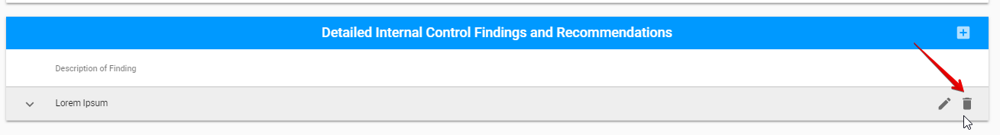
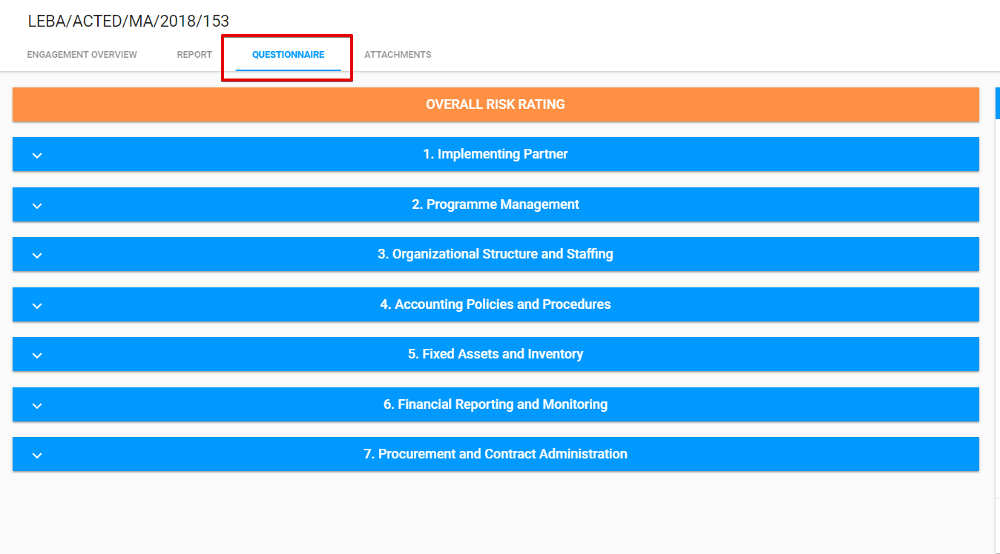
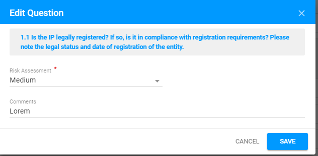
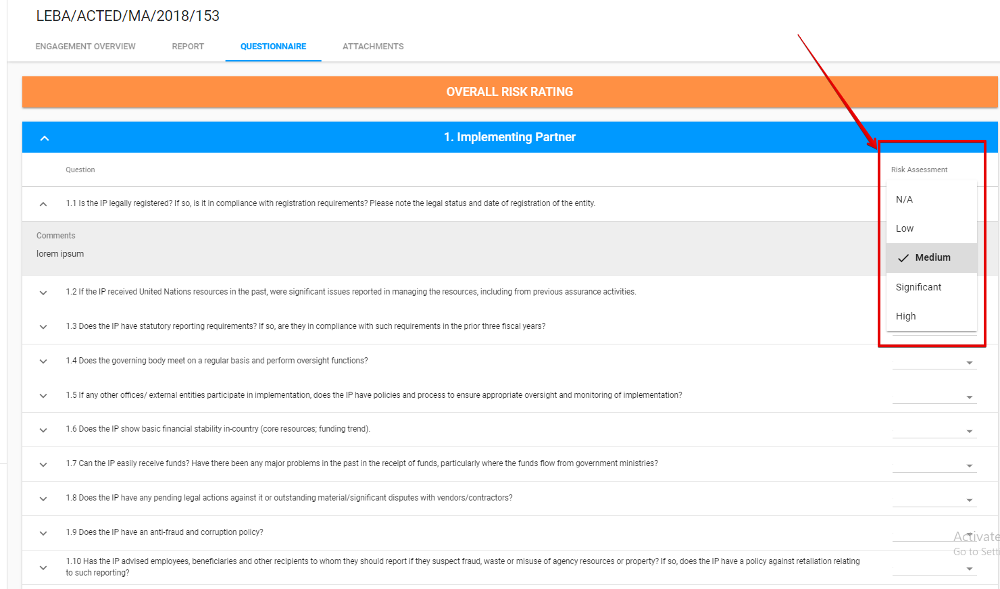

# Editable sections for Micro Assessment

The editable sections of common tabs for all Engagements types \(Engagement Overview and Attachments\) and Engagement Status section for Report tab were described [before](../editable-tabs-for-all-engagements-types.md).

Micro Assessment Engagement has several different sections in the Report tab and the additional Questionnaire tab. 

You can find the detailed description of these tabs below:



  
The Report tab for **Micro Assessment type** has the following sections:

* Engagement Status section \(the detailed information see [here](https://new-company.gitbook.io/financial-assurance-module-documentation/~/edit/drafts/-LKaWK99qUYrh74gxVNi/product-end-user-documentation/engagements/edit-by-auditor/editable-tabs-for-all-engagements-types)\)
* Overall Risk Assessment
* Tested Subject Areas
* Detailed Internal Control Findings and Recommendations

​

## Overall Risk Assessment {#overall-risk-assessment}

Here is overall user interface of this section:​

## Tested Subject Areas {#tested-subject-areas}

Tested Subject Areas section consists of the expandable rows describing the particular area.​

Each row can be edited via "Edit" button:

 The following modal window is opened after clicking the "Edit" button for each area:

## Detailed Internal Control Findings and Recommendations

The section consist of the expandable rows describes the particular Findings:

Adding of new findings is possible via the "+" button:

The following modal window is opened after clicking the "+" button:

Each row can be edited or deleted via "Edit" and "Delete" buttons accordingly:

  

  

  



Here is the overall user interface of the Questionnaire tab:

The Questionnaire tab includes 7 sections with questions the user has to answer. 

See the example of  Implementing Partner section below. 

## **Implementing Partner section** 

\(overall screen should be added later - after fixing the bug with margins\) ****

The section consists of the expandable rows describing the particular question.

The user is able to answer the question via "Edit" button: 

\(screenshot\) 

The editing is available in the following modal window:

  
Risk Assessment field can be edited via the drop-down field in the end of each row as well:

  



  

