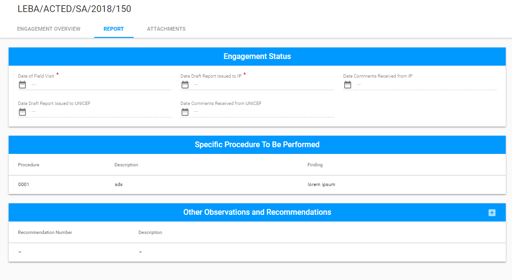
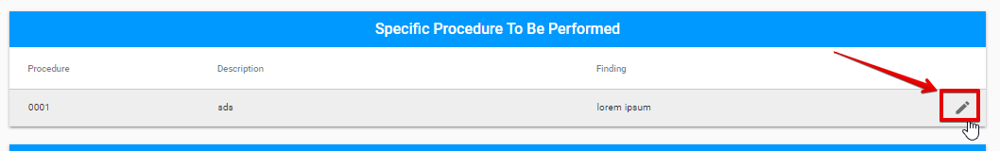
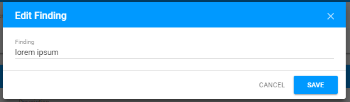
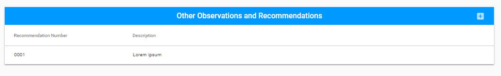
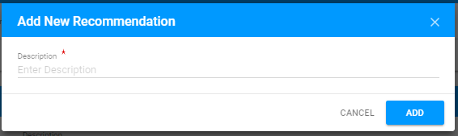
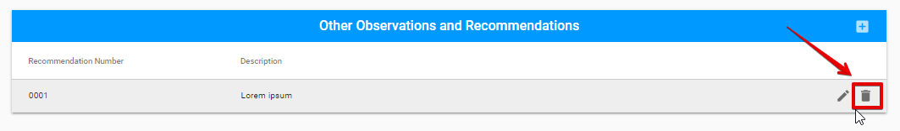

# Editable sections for Special Audit

The editable sections of common tabs for all Engagements types \(Engagement Overview and Attachments\) and Engagement Status section for Report tab were described [before](../editable-tabs-for-all-engagements-types.md).

The Report tab for **Special Audit**  has the following sections:

* Engagement status \(the detailed information see [here](https://new-company.gitbook.io/financial-assurance-module-documentation/~/edit/drafts/-LKaWK99qUYrh74gxVNi/product-end-user-documentation/engagements/edit-by-auditor/editable-tabs-for-all-engagements-types)\)
* Specific Procedure to be Performed
* Other Observations and Recommendations

## Specific Procedure to be Performed

This section can be edited by user via "Edit" button in the end of each row: 

  
The following modal window is opened after clicking the "Edit" button:

## Other Observations and Recommendations

Adding new recommendation is available via "+" button. The following modal window is opened after clicking the "+" button:

The added recommendation can be edited or deleted via "Edit" and "Delete" button accordingly.

  

  

  

