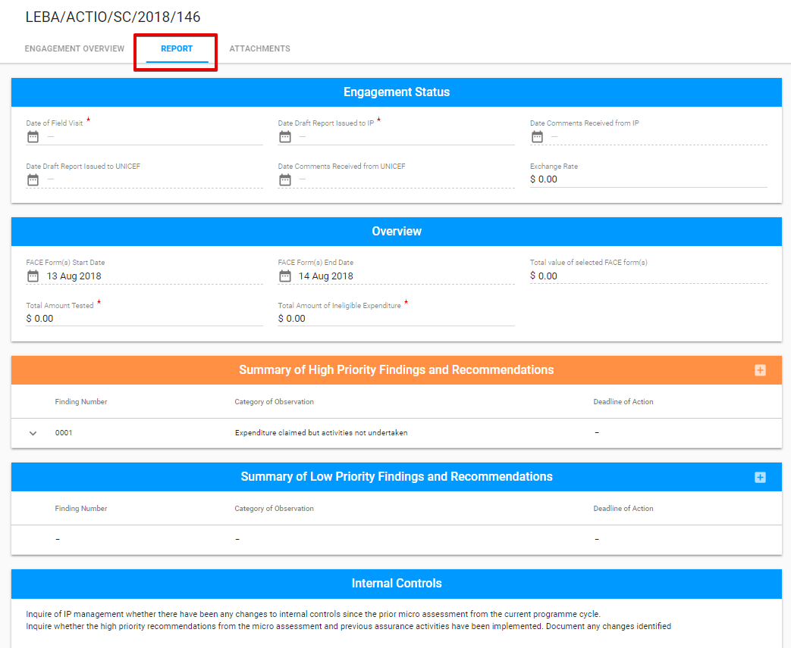
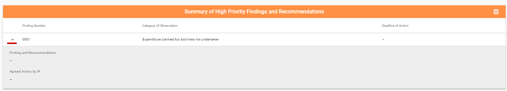
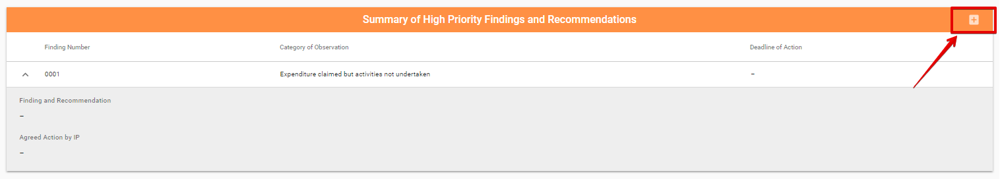
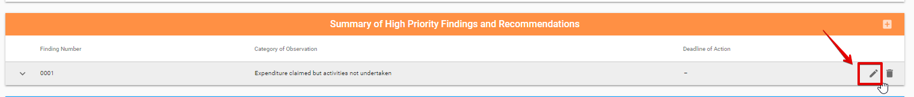
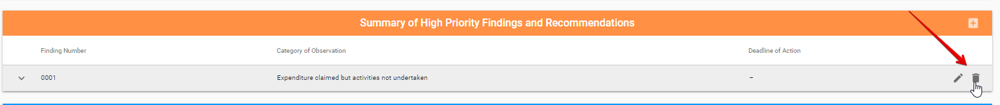
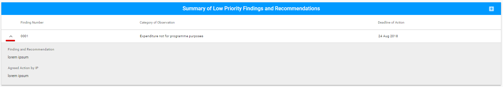
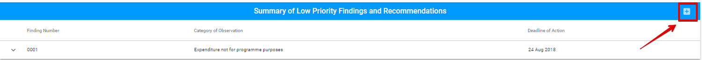
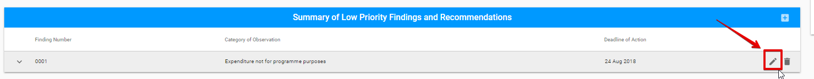
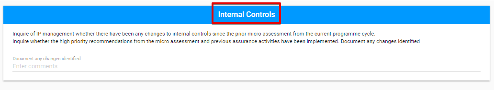

# Editable sections for Spot Check

The editable sections of common tabs for all Engagements types  \(Engagement Overview and Attachments\) and Engagement Status section for Report tab were described [before](../editable-tabs-for-all-engagements-types.md).

The Report tab for **Spot Check** has the following sections:

* Overview
* Summary of High Priority Findings and Recommendations
* Summary of Low Priority Findings and Recommendations
* Internal Controls

## Overview

## Summary of High Priority Findings and Recommendations

The section consists of the expandable rows describing particular finding:

New Finding can be added via the "+" button in the upper, right-hand corner: 

Adding of New Finding is available in the following modal window: 

Each row can be edited or deleted via the "Edit" or "Delete" button accordingly:

## Summary of Low Priority Findings and Recommendations

This section has the same design as the section described below.

Here is the overall user interface: 

Adding of new finding is available via "+" button:

  
The following modal window is opened after clicking the "+" button:

Each row can be edited or deleted via the "Edit" or "Delete" button accordingly: 

## Internal Controls

