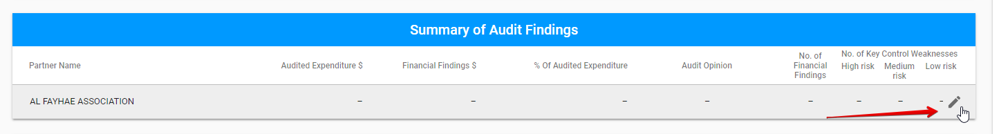
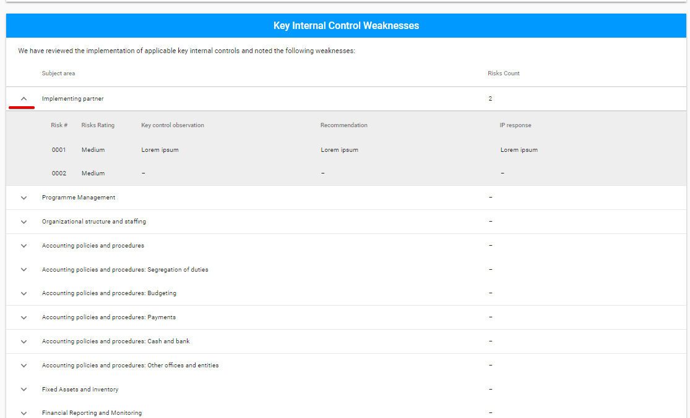
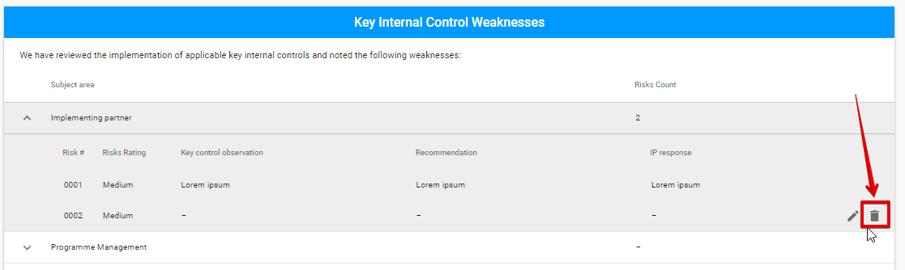

# Editable sections for Audit

The editable sections of common tabs for all Engagements types  \(Engagement Overview and Attachments\) and Engagement Status section for Report tab were described [before](../editable-tabs-for-all-engagements-types.md).

The Report tab for **Audit type** has the following sections:

* Engagement Status section \(the detailed information see [here](../editable-tabs-for-all-engagements-types.md)\)
* Summary of Audit Findings
* Financial Findings
* Assessment of Key Internal Controls
* Key Internal Control Weaknesses

## Summary of Audit Findings

The data is editable by "Edit" button in the end of each row.

Editing data is available in the following modal window: 


The fields with dashed line are non-editable and filled in after the data in the **Financial Findings** and **Key Internal Control Weaknesses** sections is entered.


## Financial Findings

The new finding can be added via "+" button in the upper, right-hand corner of the section: 

  
Adding new Finding is available in the following modal window: 

Each row can be expanded via the arrow to open the additional details:

Each Finding can be edited or deleted via the "Edit" or "Delete" button accordingly. 

## Assessment of Key Internal Controls

  
Adding new Assessment is available in the following modal window opened via "+" button: 

Each row is expandable and has "Edit" and "Delete" options.

## Key Internal Control Weaknesses

Key Internal Control Weaknesses section consists of the expandable rows describing the particular weakness. 

  
The New risk for each row can be added by "+" button:

  
Adding new Risk is available in the following modal window: 

  
Each risk can be edited or deleted via "Edit" ****or "Delete" ****button accordingly:

##  

  

  

##  

  

