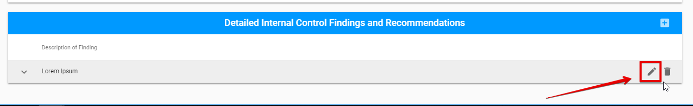

# Report for Micro Assessment

In case of the Micro Assessment Engagement type, the Report tab looks loke the following:

Micro Assessment Engagement has the additional Questionnaire tab. 

You can find the detailed description of these tabs below:

Report tab for MA has the following sections:

* Engagement status section \(the detailed information see here\)
* Overall Risk Assessment
* Tested Subject Areas
* Detailed Internal Control Findings and Recommendations

## Overall Risk Assessment

  
Here is overall user interface of this section:​

## Tested Subject Areas

  
Tested Subject Areas section consists of the expandable rows that describe the particular area.​

Each row can be edited via "Edit" button:

After User clicks on this button, the following modal window appears:

## Detailed Internal Control Findings and Recommendations

This section consist of the expandable rows that describe the particular Findings:

Auditor can add new findings using the "+" button:

After user clicks on this button, the following modal window appears:

Each row can be edited or deleted via "Edit" and "Delete" buttons correspondingly:

