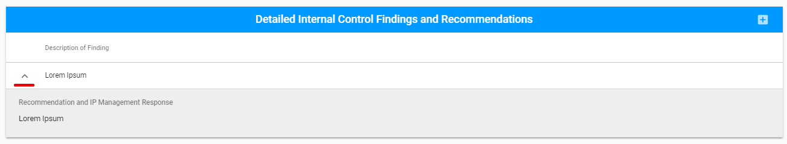
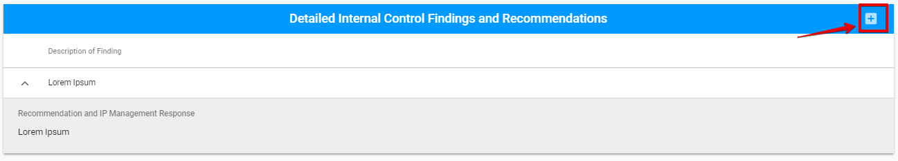
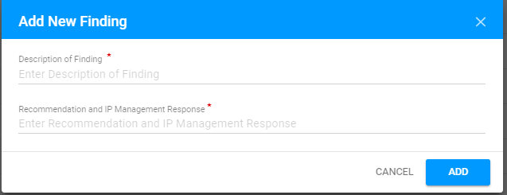
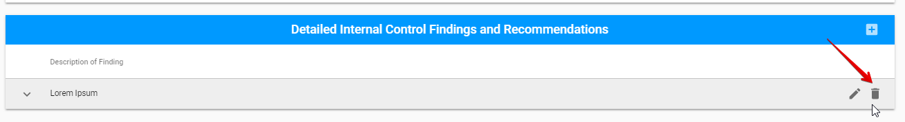
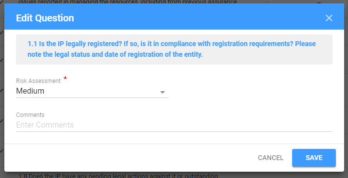

# Report for Micro Assessment

In case of the Micro Assessment Engagement type, the Report tab looks like the following:

Report tab for MA has the following sections:

* Engagement status section \(the detailed information see here\)
* Overall Risk Assessment
* Tested Subject Areas
* Detailed Internal Control Findings and Recommendations

## Engagement status

This section is the common part of the Report tab for all Engagement types 

Each field in this section represents the Audit status. So, as the Auditor fills the dates, Engagement status is changing:

## Overall Risk Assessment

  
Here is overall user interface of this section:​

## Tested Subject Areas

  
Tested Subject Areas section consists of the expandable rows that describe the particular area.​

Each row can be edited via "Edit" button \("Edit" button appears after user hover the mouse over the particular line from the Tested Subject Areas list\):

After User clicks on this button, the following modal window appears:

## Detailed Internal Control Findings and Recommendations

This section consist of the expandable rows that describe the particular Findings:

Auditor can add new findings using the "+" button:

After user clicks on this button, the following modal window appears:

Each row can be edited or deleted via "Edit" and "Delete" buttons correspondingly \("Edit" and "Delete" buttons appear after user hover the mouse over the particular line from the Findings list\):

##  **Questionnaire** tab

  
Micro Assessment Engagement has the additional **Questionnaire** tab that needs to be filled in before the Submission of the Report. 

Questionnaire is the list of questions, divided by sections:

There are 7 sections and each section has different number of questions. Auditor has to estimate the Risk Assessment for each question. It can be done by using the dropdown fields that are placed on the right side of every question:

Each section of questions and each question can be expandede via the arrow buttont at the left hand corner of the rows. Auditor can use the "Edit" button at the right side of each question \(appears by mouse hover on the line\) to write mode details on the specific question:

 After the user clicks on this button, the following modal window appears:

