# Report for Spot Check

In case of the Spot Check Engagement type, the Report tab looks like the following:

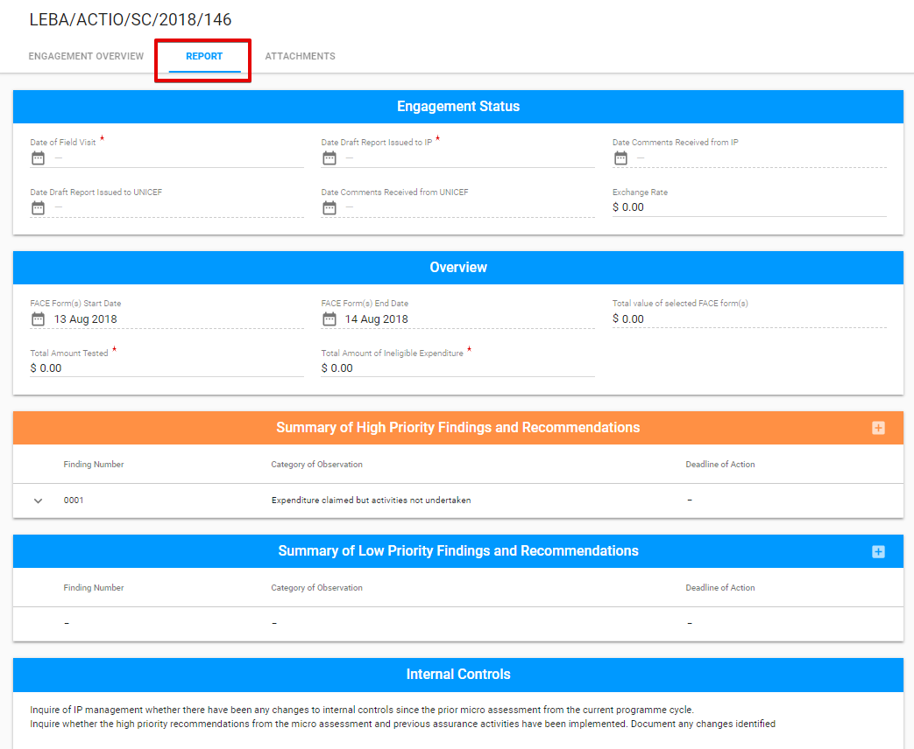

The Report tab for **Spot Check** has the following sections:

* Engagement Status
* Overview
* Summary of High Priority Findings and Recommendations
* Summary of Low Priority Findings and Recommendations
* Internal Controls

## Engagement status

This section is the common part of the Report tab for all Engagement types 

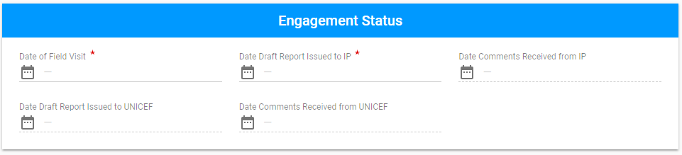

Each field in this section represents the Audit status. So, as the Auditor fills the dates, Engagement status is changing:

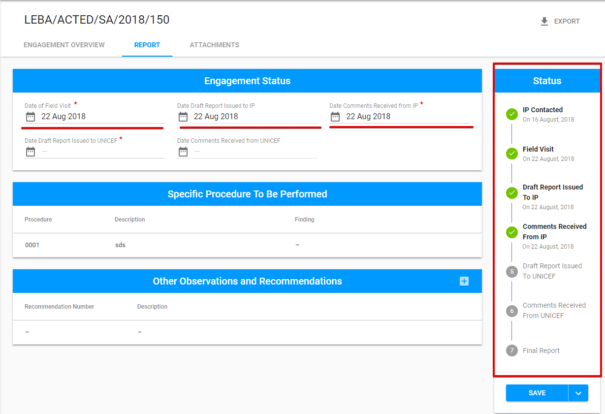

## Overview

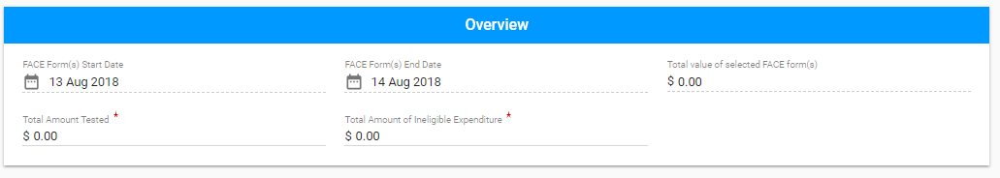

## Summary of High Priority Findings and Recommendations

The section consists of the expandable rows that describe the particular finding:

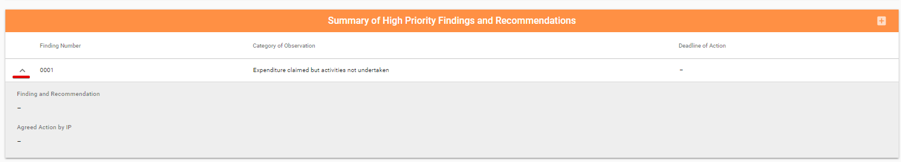

User can add New Finding via the "+" button in the upper right-hand corner: 

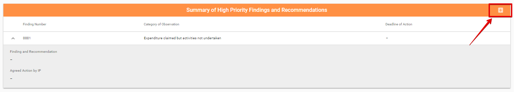

After Auditor clicks on this button, the following modal window appears:

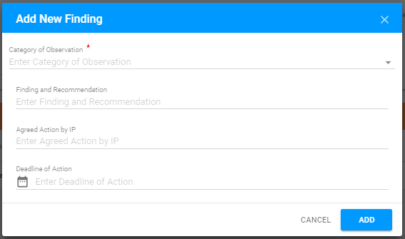

Each row can be edited or deleted via the "Edit" or "Delete" buttons correspondingly \("Edit" and "Delete" buttons appear after user hover the mouse over the particular line from the Findings list\):

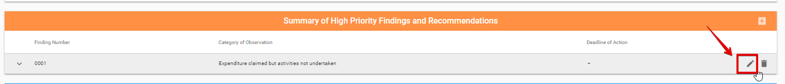

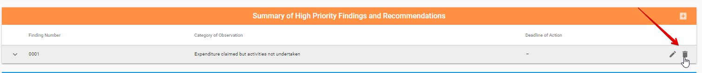

## Summary of Low Priority Findings and Recommendations

This section has the same design as the section described earlier.

Here is the overall user interface: 

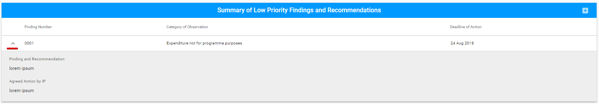

User can add New Finding is available via "+" button:

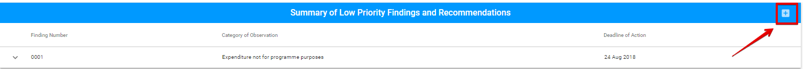

  
After Auditor clicks on this button, the following modal window appears:

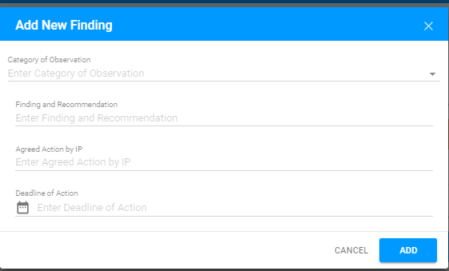

Each row can be edited or deleted via the "Edit" or "Delete" button correspondingly \("Edit" and "Delete" buttons appear after user hover the mouse over the particular line from the Findings list\): 

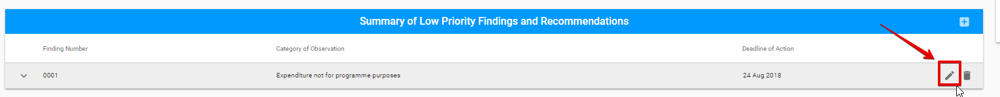

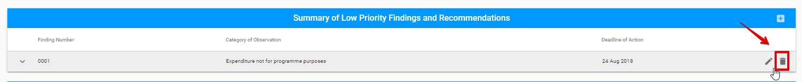

## Internal Controls

In this section Auditor can document information regarding the Internal Controls: 

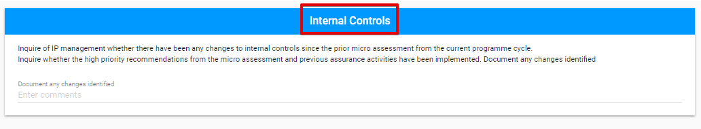

