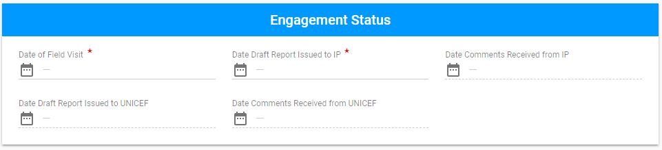
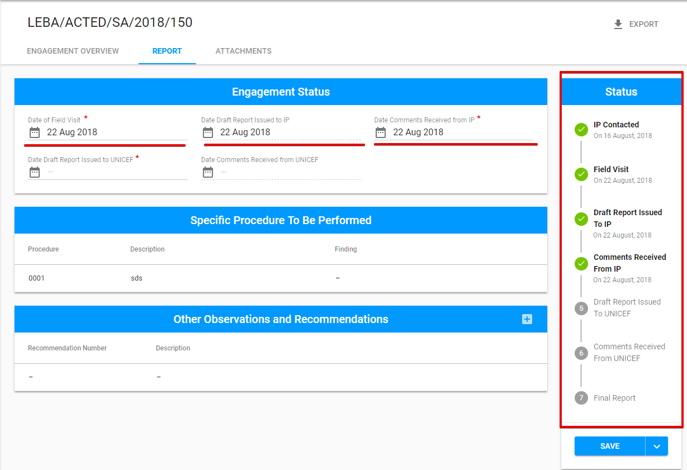
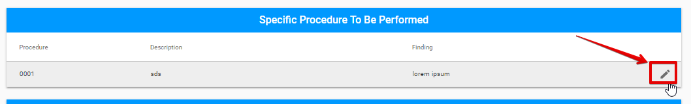
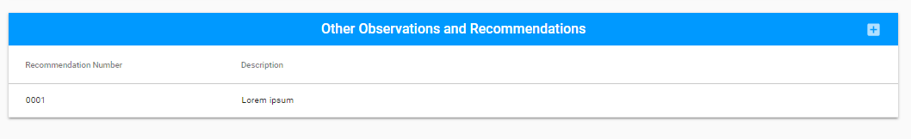
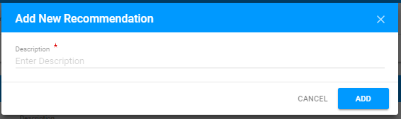
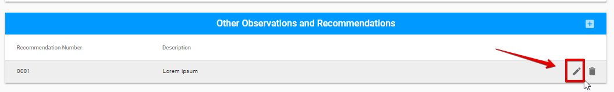
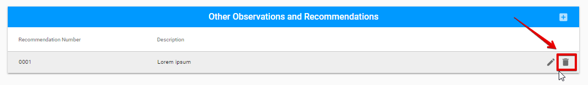

# Report for Special Audit

In case of the **Special Audit** Engagement type, the Report tab looks like the following:

The Report tab for **Special Audit**  has the following sections:

* Engagement status 
* Specific Procedure to be Performed
* Other Observations and Recommendations

## Engagement status

This section is the common part of the Report tab for all Engagement types 

Each field in this section represents the Audit status. So, as the Auditor fills the dates, Engagement status is changing:

## Specific Procedure to be Performed

User can edit this section via "Edit" button at the end of each row: 

  
After Auditor clicks on this button, the following modal window appears:

## Other Observations and Recommendations

Auditor can add New Recommendation  via "+" button: 

User can edit or delete the existing Recommendation via "Edit" and "Delete" buttons correspondingly:

