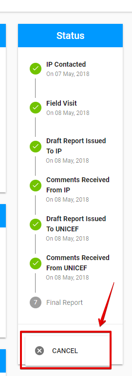
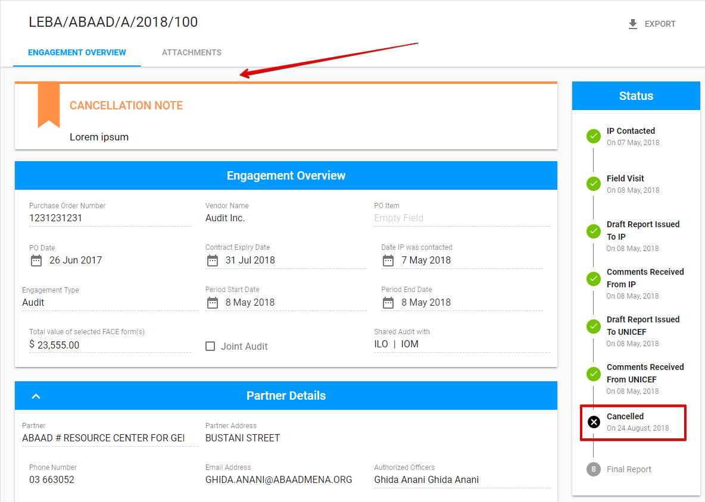

# Cancellation

Engagement cancellation is available via **"Cancel"** button.

The "Cancel" option can be find in the drop-down list of the split button **"Save".**  

The user have to fill in **cancellation reason** in the following modal window opened after clicking the "Cancel" button:

Cancelled engagement is marked with the cancellation note in the top of the screen. The status is changed to **"cancelled"**. 

