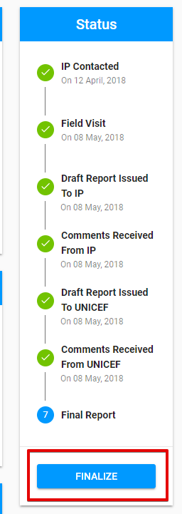
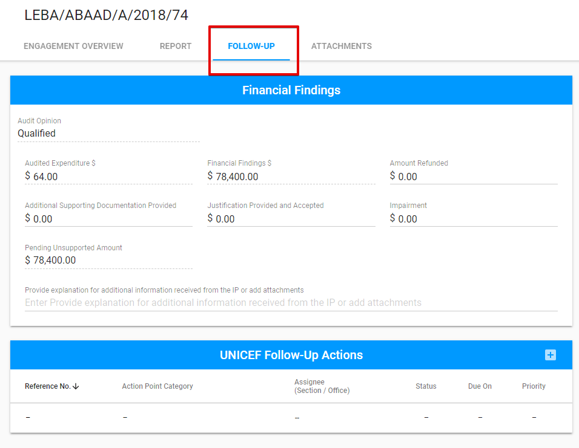
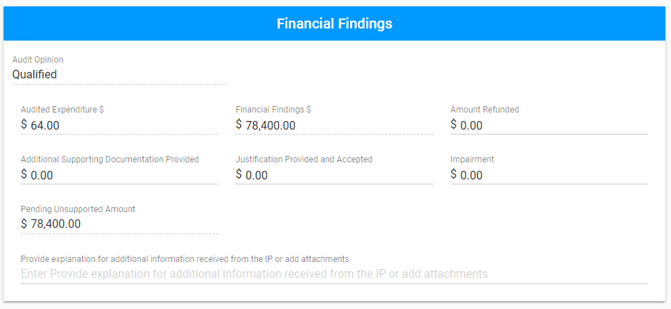
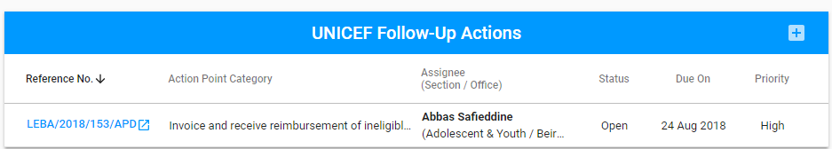
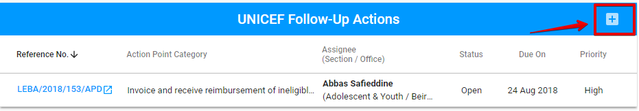
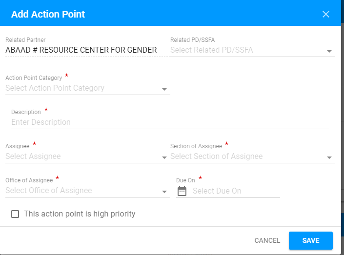
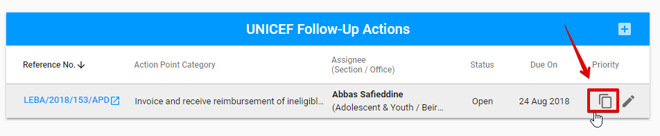
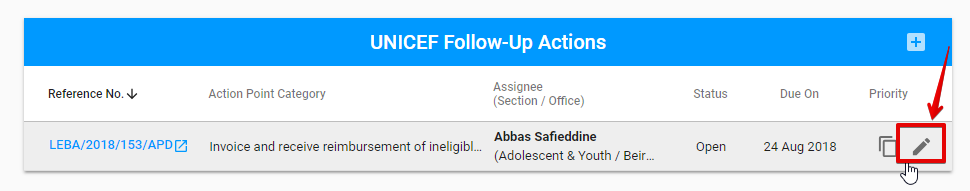

# Finalize the Engagement

UNICEF Focal point user, who has created the Engagement, can Finalize the Engagement. See more details about user rights [here](../overview/user-roles-and-permissions.md). 

The option is available for Engagements with **"Report submitted"** status. 

The button **"Finalize"** is displayed at the bottom of the Status panel. 

After the user clicks on the "Finalize" button, the Engagement status is changing to the **"Final Report".** 

After the Engagement was finalized, the **Follow-up** tab appears. 

The Follow-Up tab includes the following **sections** in accordance with the Engagement type: 

<table>
  <thead>
    <tr>
      <th style="text-align:left">Sections/Engagement type</th>
      <th style="text-align:left">Audit/Spot Checks</th>
      <th style="text-align:left">Micro Assessment/Special Audit</th>
    </tr>
  </thead>
  <tbody>
    <tr>
      <td style="text-align:left">
        

        
Financial Findings section

      </td>
      <td style="text-align:left">Y</td>
      <td style="text-align:left">N</td>
    </tr>
    <tr>
      <td style="text-align:left">
        

        
UNICEF Follow-Up Actions section

      </td>
      <td style="text-align:left">Y</td>
      <td style="text-align:left">Y</td>
    </tr>
  </tbody>
</table>## **Financial Findings section** 

The fields with dashed lines is non-editable. Other fields can be edited.

Changes can be saved via "Save" button, displayed at the bottom of the status panel.

## **UNICEF Follow-Up Actions section**  

Here is the overall UI: 

The new Follow-Up Action can be added via "+" button in the upper right-hand corner: 

The following modal window appears after the user clicks the "+" button: 

Each Follow-Up Action, called also the Action point, added to the section, can be duplicated or edited via "Duplicate" and "Edit" buttons correspondingly \( "Duplicate" and "Edit" buttons appear after user hover the mouse over the particular line from the UNICEF Follow-Up Actions list\):

Clicking on the reference number for the particular action point will take user to the corresponding Action point details screen on the Action Point Dashboard. 

See more details of the Action points in the [Action Point Dashboard Documentation.](https://new-company.gitbook.io/action-points-dashboard/)  

