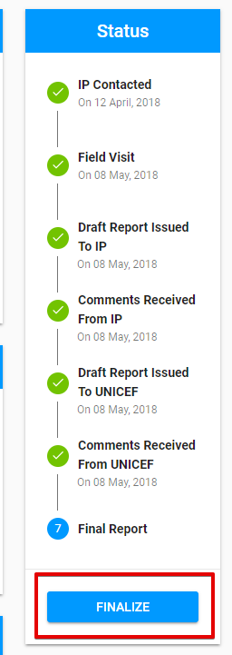

# How to finalize the engagement?

Finalization of the engagement is allowed for UNICEF Focal point who was created the engagement. See more details about user rights [here](../../overview/user-roles-and-permissions.md). 

The option is available for engagements with **"Report submitted"** status. 

The button **"Finalize"** is displayed in the bottom of the Status panel. 

The status of engagement is changed to **"Final report"** after the user performs the finalization.

After the Engagement was finalized the **Follow-up** tab appears. See more details [here](follow-up-tab.md).

