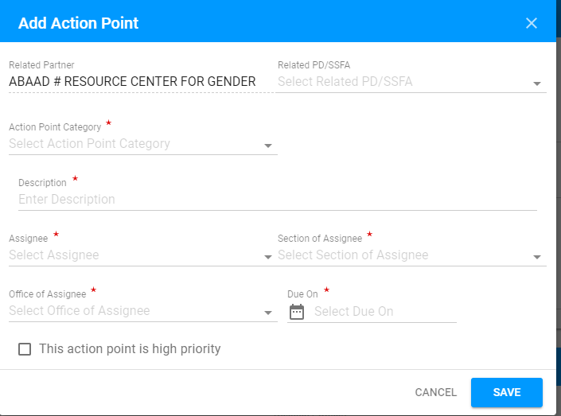

# Follow-up tab

The Follow-up tab includes the following  **sections** in accordance with the Engagement type: 

| Sections/Engagement type | Audit/Spot Checks | Micro Assessment/Special Audit |
| :--- | :--- | :--- |
| Financial Findings section | Y | N |
| UNICEF Follow-Up Actions section | Y | Y |

## **Financial Findings section** 

The fields with dashed lines is non-editable. Other fields can be edited.

Changes can be saved via "Save" button displayed in the bottom of the status panel.

## **UNICEF Follow-Up Actions section**  

Here is the overall user interface: 

The new Action point can be added via "+" button in the upper, right-hand corner: 

The following modal window is opened after clicking the "+" button: 

Each Action point added to the section can be duplicated or edited via "Duplicate" and "Edit" button accordingly:

Clicking on the reference number for the particular action point moves user to the corresponding Action point details screen in the Action Point Dashboard. 

More detailed information of the Action points see in the [Action Point Dashboard Documentation.](https://new-company.gitbook.io/action-points-dashboard/)  

  

  

