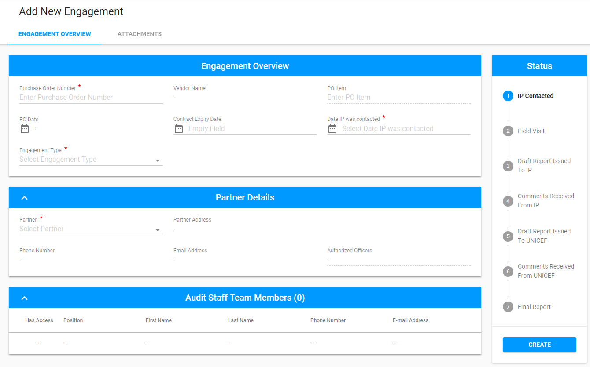
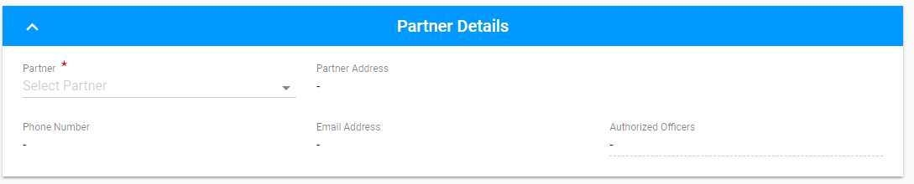
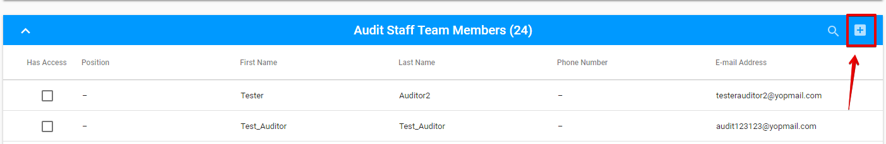
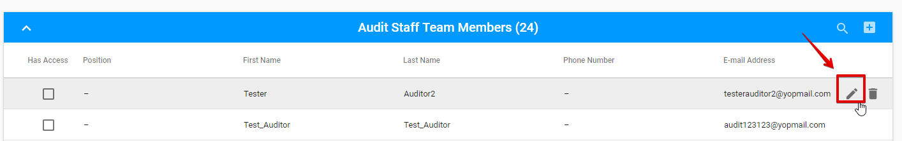
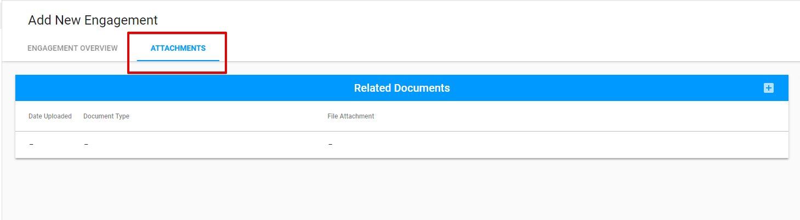
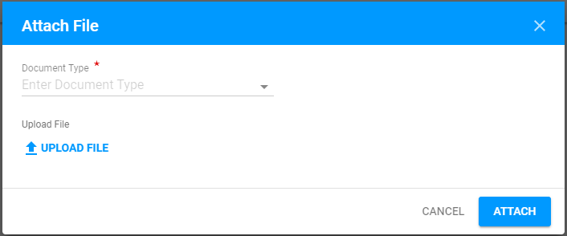
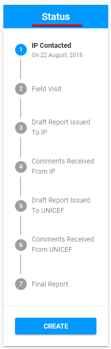

# Creation of Engagement


Creation of engagement is available for **UNICEF Focal Point** user. See more details about user rights in the ["User roles and permissions" ](../overview/user-roles-and-permissions.md)article.


User can **Add** **New Engagement** by clicking the "Add New Engagement"  button, placed in the upper right-hand corner of the Engagements screen.

The following screen is opened after the user clicks  the "Add New Engagement" button:


User can create 4 different types of Engagements:  Audit, Micro Assessment, Spot Check and Special Audit. Each engagement type has some differences comparing to the other ones, and they will be discussed in details in the corresponding sections.


There are **3 sections** displayed on the screen:

* Engagement Overview tab
* Attachment tab
* Status panel with "Create" button.

Click on each tab below for more details:



Engagement Overview tab includes the following **sections**: 

* Engagement Overview
* Partner Details
* Audit Staff Team Members 
* Specific Procedure To Be Performed \(only for Special Audit\)

## Engagement Overview section

Displayed fields in this section vary depending on the type of the Engagement, that was chosen \(Audit, MA, SC, Special Audit\).

**Example** \(Audit type is selected\):


If Audit or Spot check Engagement type is selected, user can see the tool-tip, that on mouse hover reminds to attach the required documents.  


Some fields \(PO Date, Vendor Name, Contract Expiry Date\) are filled in automatically after entering the Purchase Order Number.

## Partner Details section

The most part of this section is filled in automatically after choosing the Partner.

## Audit Staff Team Members section

The list of auditors is compiled in accordance with the entered Purchase Order Number.

User can select exiting auditor in the Audit Staff Team Members list or add a new Auditor via the "+" button in the upper right-hand corner of the list:

Add New Audir Staff Team Member modal window is presented in the following screenshot:

User can grant the access to the particular auditor in the modal window during the creation or via check-box in the list of Auditors: 

**Editing/Deleting**

There is an opportunity to edit or delete Audit Staff Team Member via the "Edit" and "Delete" button correspondingly \( "Edit" and "Delete" buttons appear after user hover the mouse over the particular line from the APs list\).

**Searching**

Search in the Audit Staff Team Members list is available via "Search" icon in the upper right-hand corner near the "+" button:

User can choose the number of the rows, displayed per page \(The default value is 10 rows per page\).

## Specific Procedure To Be Performed 


This section is available only in case the **Special Audit** type is selected.


User can add New Specific Procedure To Be Performed  via "+" button: 

Add New Procedure modal window is presented in the screenshot: 





Attachments tab has the Related Documents section, that allows to Add new documents via "+" button:

The attached file can be edited and deleted by "Edit" and "Delete" buttons respectively.




Status panel includes 7 status fields. 

Under the status name user can find the date of the status change.  

New Engagement has **IP Contacted** status. 

Other statuses are activated after the Auditor fills in the corresponding fields in the Engagement's Report \(see more details [here](edit-by-auditor/)\).



When the required information is entered, the user can click the "Create" button at the bottom of the status panel to create the Engagement.


If no Audit Staff Team Members are granted the access to the Engagement, the following error will appear when user will try to Create Engagement:


**Created** Engagement has the reference number, displayed at the top of the screen and the status **"IP Contacted".** 

## Modification after creation

After the Engagement was created, UNICEF Focal point user is able to edit the following sections of the Engagement:

* Audit Staff Team Members 
* Attachments \(Related Documents\) 

## **Email notification**

The following email of granted access is sent to the Auditor after the Engagement was created:

