# How to add the Engagement?

**Adding** new engagement is available by clicking "Add New Engagement"  button placed in the upper, right-hand corner of the Engagements screen.

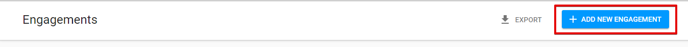

 When the button is clicked, the following screen is displayed to the user:

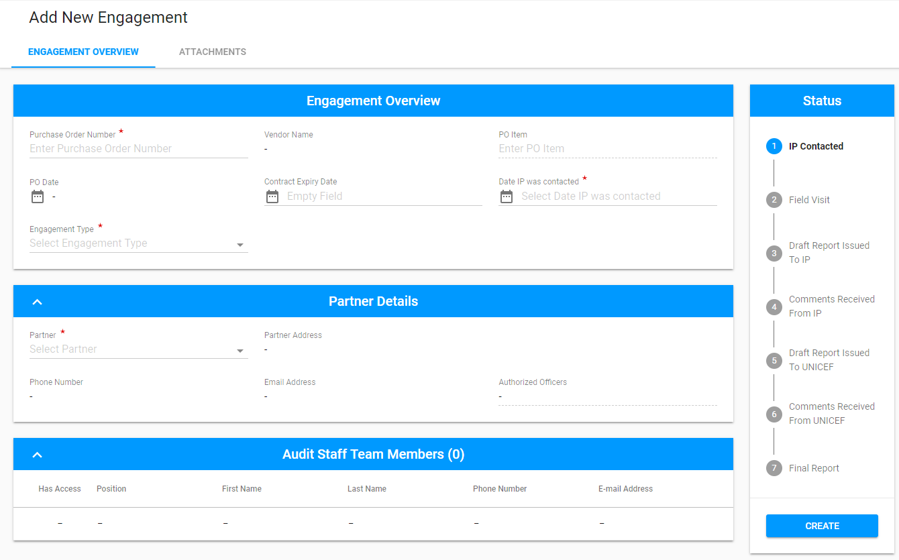

There are **3 parts** displayed on the screen:

* Engagement Overview tab
* Attachment tab
* Status panel with "Create" button.

Click on each tab below for more details:



Engagement Overview tab includes  the following **sections**: 

* Engagement Overview
* Partner Details
* Audit Staff Team Members 
* Specific Procedure To Be Performed \(only for Special Audit\)

## Engagement Overview section

The set of fields for this section depends on the selected type of Engagements \(Audit, MA, SC, Special Audit\).

Example \(Audit type is selected\):

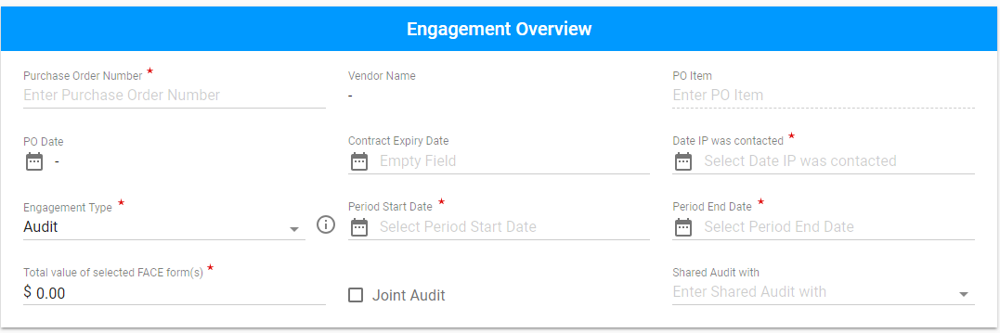


If Audit or Spot check is selected the **tool-tip** is displayed **for** reminding the user of adding attachments. 


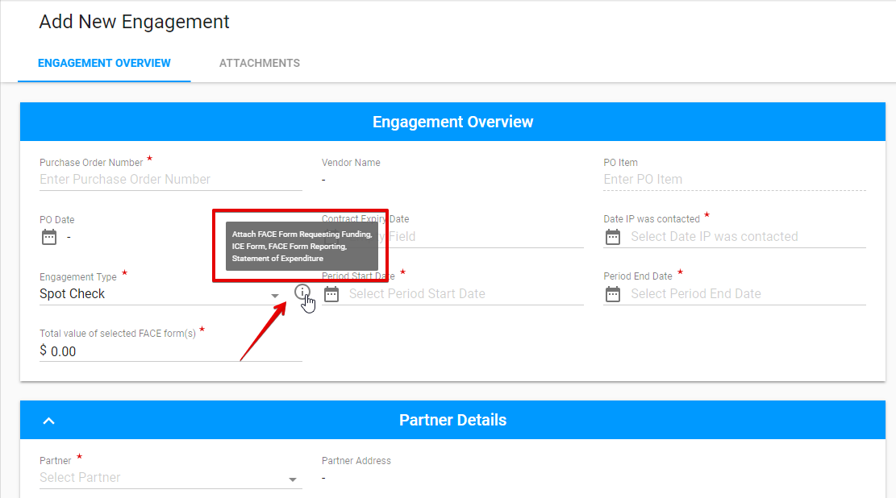

The part of the fields \(PO Date, Vendor Name, Contract Expiry Date\) is filled in automatically after entering the Purchase Order Number.

## Partner Details section

The most part of this section is filled in automatically after entering the Partner.

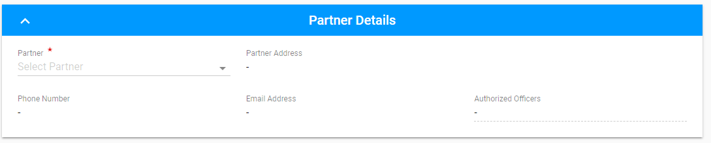

## Audit Staff Team Members section

The list of auditors is compiled in accordance with the entered Purchase Order Number.

Adding new Auditor is available via the "+" button in the upper, right-hand corner of the list:

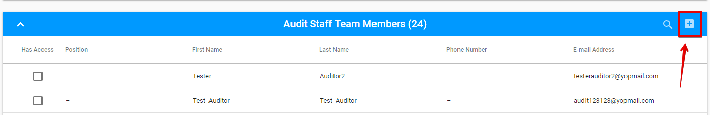

Here is the modal screen for adding new Audit Staff Team Member: 

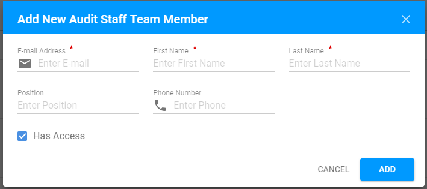

The user is able to grant the access to the particular auditor in the modal screen during creation or via check-box in the list of auditors: 

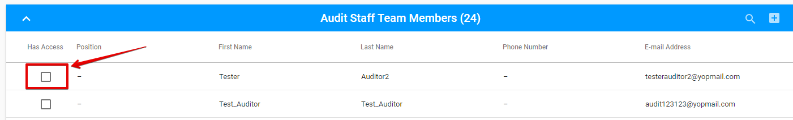

**Editing/Deleting**

There is an opportunity to edit or delete audit staff team member via "Edit" and "Delete" button accordingly.

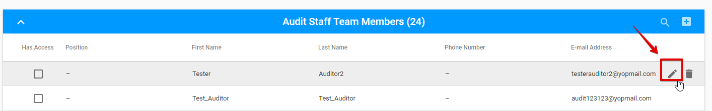

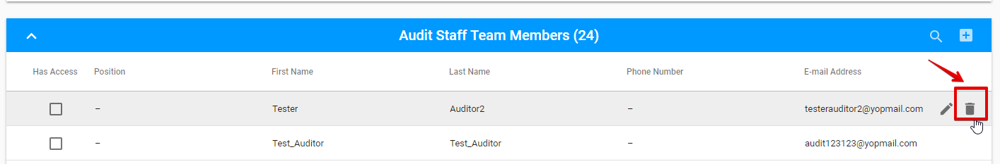

**Searching**

The searching is available via "Search" icon in the upper, right-hand corner near the "+" button:

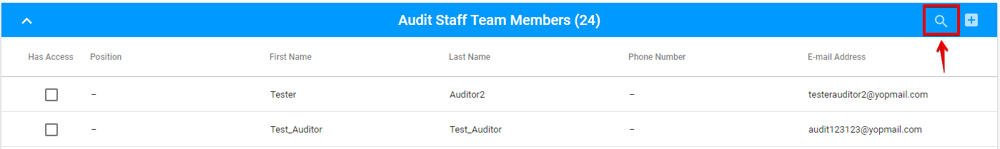

Displayed rows in the list of Auditors can be **limited per page**. The default is 10 rows per page.

## Specific Procedure To Be Performed \(only for Special Audit type\)

This section is available only in case the Special Audit type is selected.

Adding new procedure to be performed is available via "+" button: 

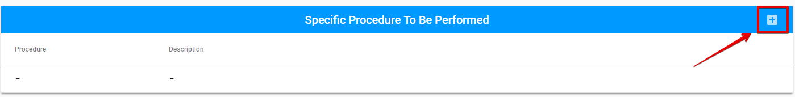

Here is the modal screen for adding new procedure: 

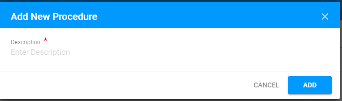



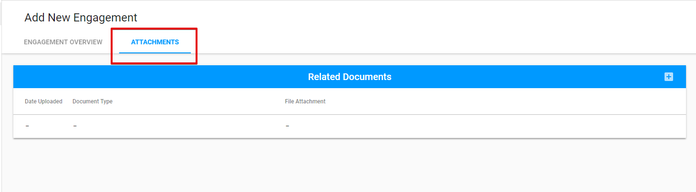

The Related Documents section is displayed on the Attachments tab. 

Adding new document is available is available in the following modal window opened via "+" button:

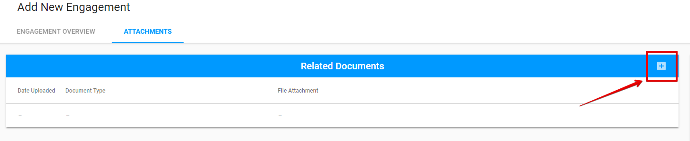

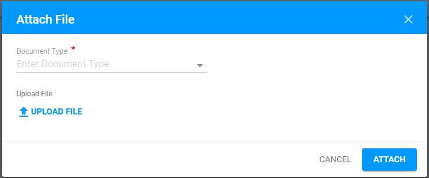

The attached file can be edited and deleted by "Edit" and "Delete" button accordingly.

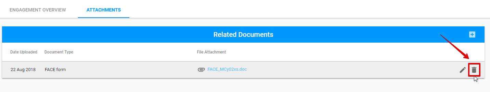



Status panel includes 7 status fields. 

The date appears below each status after entering the corresponding fields.  

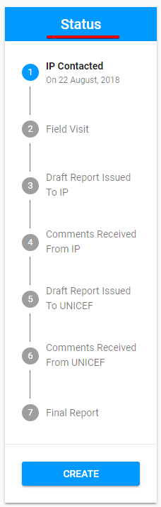

New Engagement has the status **IP Contacted**. 

Other statuses are activated after the Auditor reports the engagements \(see more details [here](../edit-by-auditor/)\).



