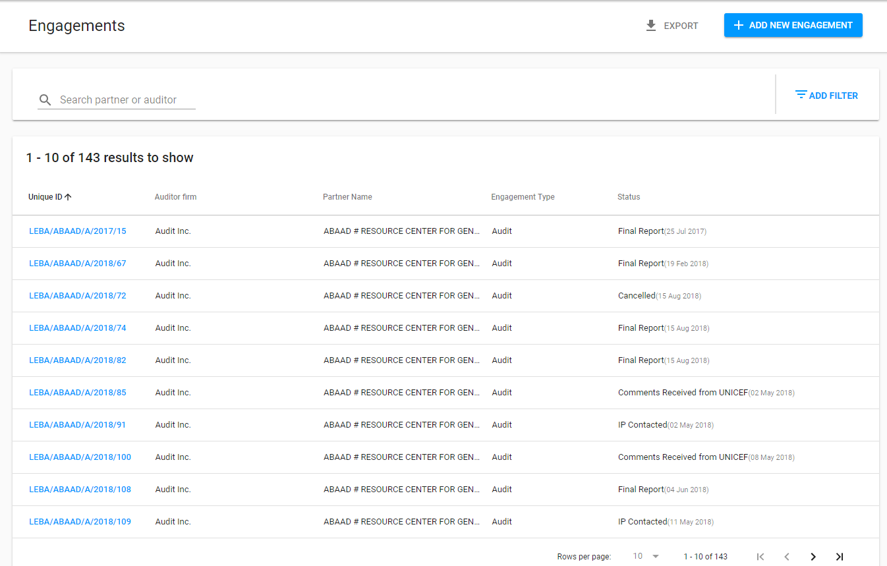

# List of Engagements

List of Engagements contains Engagements of all types.  Here is the overall user interface:

Each row can be **sorted by columns** in either ascending or descending order.

Displayed rows in the table can be **limited per page**. The default is 10 rows per page.

Clicking on the reference number for each row will take user to the corresponding Engagements Details.

## Export

The List of Action points can be exported to **CSV** file by "Export" button in the upper, right-hand corner.

## Searching

 The user is able to use the search bar in the upper, left-hand corner to execute a data search.

## Filtering

 In the upper, right-hand corner the user can use "Add filter" option with set of parameters to be chosen.

 The additional search field appears behind search bar after particular filter parameter has been selected.

 **Example:** Filter “Auditor“ is selected:

