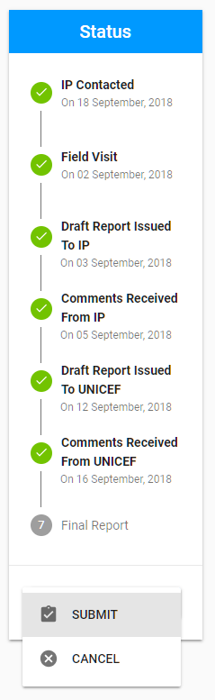
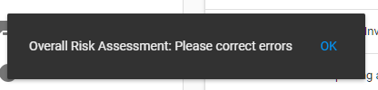

# Submitting of Engagement

After the Auditor has filled in all required fields in the Report tab and attached the Report document in the Attachments tab, the Report can be sumbitted.

To Submit the Report, user need to click on the split button "Save" and choose the Submit option:

In case user has missed some required fields, Report won't be submitted and user will see the notification with the description of the fields that needs to be filled in:

