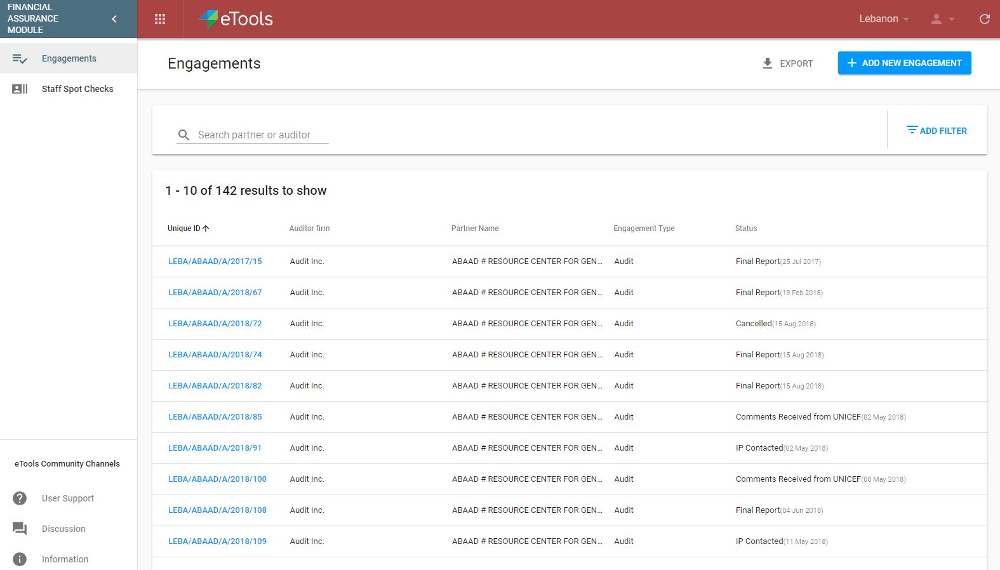
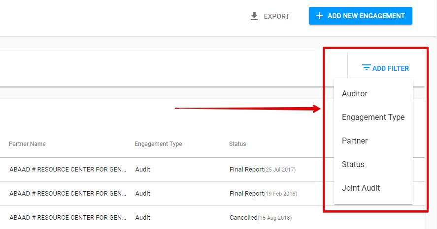

# Financial Assurance Module Navigation

### There are 3 ways to access the FAM.

There are 3 ways to access the FAM:

## **1\)** via the app icon 

  User can switch to the FAM by selecting “Financial Assurance” module icon:

## 2\) via the direct link 

The user can access the FAM via the link in the email to a **particular engagement, that** is accessed to him or via a link for **signing in to** FAM.

## 3\) **via the Action Point Dashboard** \(through the link to related task for AP created in the FAM\) 

 1\) The user should switch to Action Point Dashboard via icon  by selecting “Action Points”:

2\)  The user should filter the list of Action Points by Financial Assurance  "Related App":

3\) The user should click the reference number in the particular row to open the action point details screen.

4\) Clicking the link in the "Related Document" field will move the user to the FAM: 

