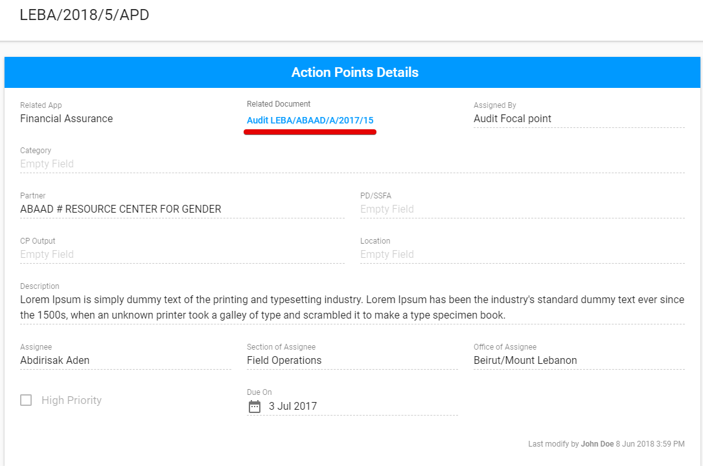

# How to get to the FAM?

## **1\)** via app icon 

 Switching to another FAM by selecting “Financial Assurance”:

## 2\) via a link 

The user can access the FAM via the link in the email to a **particular engagement** which is accessed to him or via a link for **signing in** FAM.

## 3\) **via Action Point Dashboard** \(through the action point created in the FAM\) 

The following steps should be performed in the Action Point Dashboard: 

1\) Filter the list of Action Points  by Financial Assurance  "Related App" 

2\) Open the action point details screen for the AP created  in FAM by clicking on the reference number in the particular row.

 3\) Click the link in the "Related Document" field: 

