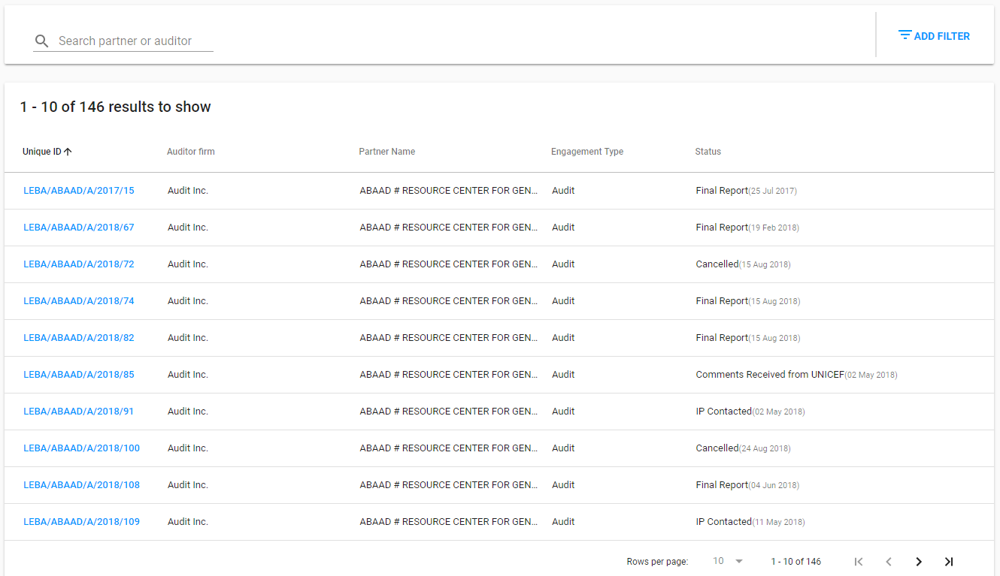

# Overall User Interface

The overall user interface for Financial Assurance Module is presented in the following screenshot:

The following sections are represented for overall UI:

**Header** with:

* reload icon,
* profile dropdown,
* country dropdown,
* app icon to switch to another application or repository.

**Сollapsible left navigation panel** with:

In the top:

* label,
* Engagements section,
* Staff Spot Checks section.

In the bottom:

* eTools Community Channels \("Knowledge Base", "Discussion", "Information"\)

 **List of Engagements** is the main element on this page:

This list provides the ability to manage all of the created Engagements: open details of the specific Engagement or quickly see its overview. Detailed description of this list can be found[ here.](engagements/list-of-engagements.md)

