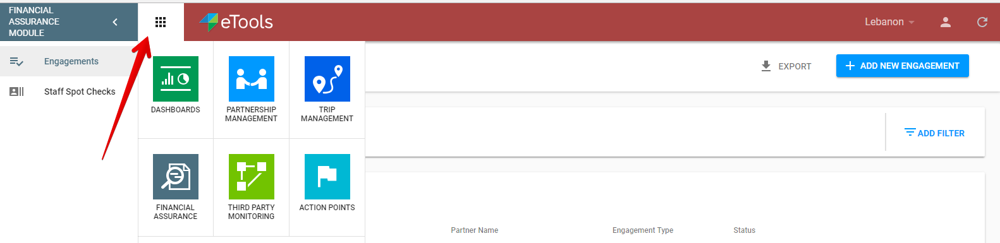

# Overall User Interface

The overall UI for Financial Assurance Module is presented in the following screenshot:

The following sections are represented for overall UI:

**Header** with:

* reload icon,
* profile dropdown,
* country workspace,
* app icon to switch to another application or repository.

**Сollapsible left navigation panel** with:

At the top:

* label with the module name,
* Engagements section,
* Staff Spot Checks section.

At the bottom:

* eTools Community Channels \("Knowledge Base", "Discussion", "Information"\)

**List of Engagements** is the main element on this page:

  
This list provides the ability to manage all of the created Engagements, open details of the specific Engagement and access the Report, Follow-Ups and Attachments. 

Detailed description of the Engagements list can be found [here](https://razortheory.gitbook.io/financial-assurance-module-documentation/~/edit/drafts/-LMCFaMf3pf4SDYfAvvB/product-end-user-documentation/engagements/list-of-engagements).  

