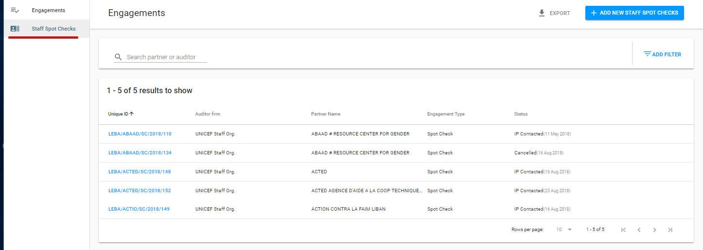
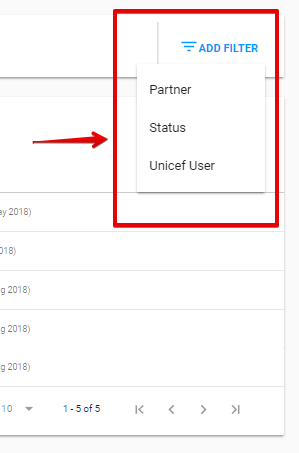
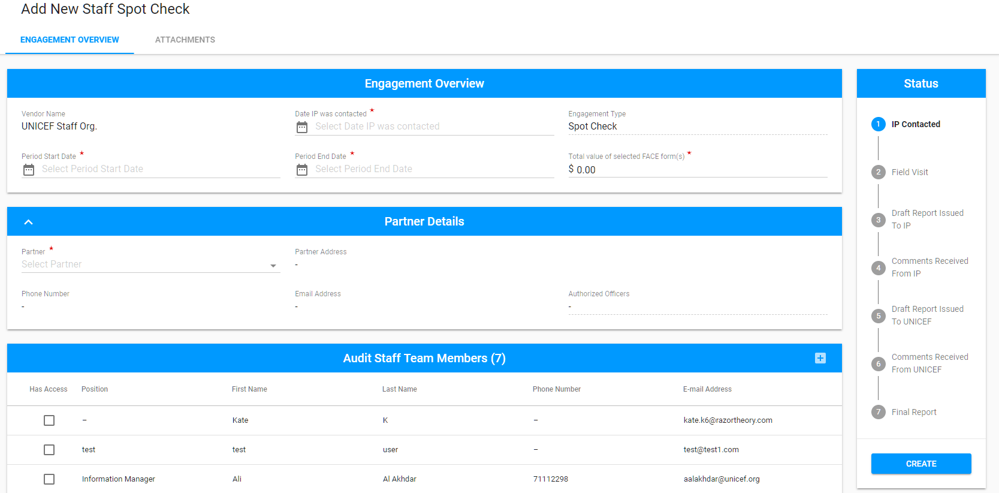

# Staff Spot Checks section

Staff Spot Checks section provides an opportunity for creating and tracking the Engagements with UNICEF vendors. 


This section is available for UNICEF Staff only.


## List of Staff Spot Checks

List of Staff Spot Checks is the main element on this page. Here is the overall UI of the List of Staff Spot Checks:

The UI of the List of Staff Spot Checks is similar to the List of Engagements \(see [here](https://razortheory.gitbook.io/financial-assurance-module-documentation/~/edit/drafts/-LON3dQFII7ruNgslx2y/product-end-user-documentation/engagements)\). 

For List of Staff Spot Checks user can apply Filters. There are 3 of them: by Partner, Status and Unicef User.

## Add New Staff Spot Check

User can add New Staff Spot Check in a similar manner as the Engagement, that is described in detail [here](https://razortheory.gitbook.io/financial-assurance-module-documentation/~/edit/drafts/-LMfUh4DCZiwMDxpaXwy/product-end-user-documentation/engagements/how-to-add-new-engagement).

Here is the overall UI: 

The Engagement Overview section has some differences from the regular Engagement: 

* The Vendor name filed is filled in by default and is non-editable for user.
* The Audit Staff Team Member section is filled with auditors linked to the UNICEF Staff organization.

Reporting, modification and finalization of the Engagement is performed in the same way as for [Engagements section](https://razortheory.gitbook.io/financial-assurance-module-documentation/~/edit/drafts/-LMfUh4DCZiwMDxpaXwy/product-end-user-documentation/engagements). 

