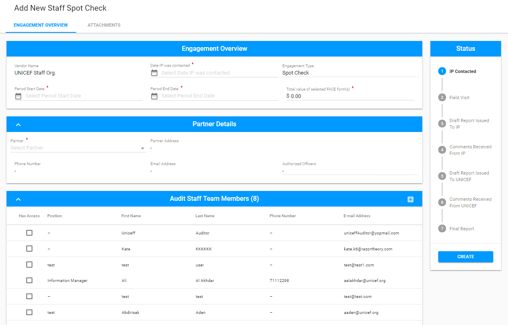

# Addition of Staff Spot Check

User can add New Staff Spot Check in a similar manner as the Engagement, that is described in detail [here](https://razortheory.gitbook.io/financial-assurance-module-documentation/~/edit/drafts/-LMfUh4DCZiwMDxpaXwy/product-end-user-documentation/engagements/how-to-add-new-engagement).

Here is the overall user interface: 

The Engagement Overview section has some differences from the regular Engagement: 

* The Vendor name filed is filled in by default and is non-editable for user.
* The Audit Staff Team Member section is filled with auditors linked to the UNICEF Staff organization.

Reporting, modification and finalization of the Engagement is performed in the same way as for [Engagements section](https://razortheory.gitbook.io/financial-assurance-module-documentation/~/edit/drafts/-LMfUh4DCZiwMDxpaXwy/product-end-user-documentation/engagements). 

