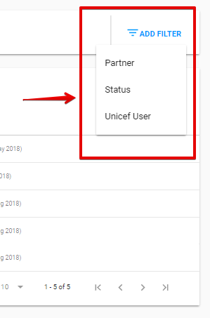

# List of Staff Spot Checks

Here is the overall user interface of the List of Staff Spot Checks:

The user interface of the List of Staff Spot Checks is similar to the [List of Engagements](../engagements/list-of-engagements.md). 

For List of Staff Spot Checks user can apply Filters. There are 3 of them: by Partner, Status and Unicef User.

