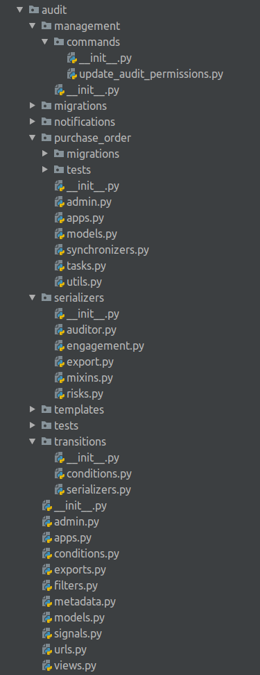
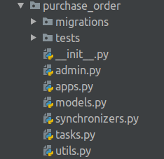

# Backend Module structure

### Audit module files structure

`management` - specific management commands \(in our case there is only one command for updating permissions\)  
`migrations` - database migrations  
`notifications` - templates for email notifications  
`purchase_order` - nested global application to keep shared across the countries information about the auditor firm  
`serializers`- rest framework serializers  
    - `auditor.py` - serializers for auditor firm, staff members, purchase orders  
    - `engagement.py` - engagement related serializers \(Audits, SpotChecks, Attachments, etc\)  
    - `export` - everything that is related to CSV& PDF exports  
    - `mixins.py` - specific serializers mixins  
    - `risks.py` - Risks serializers \(mainly used in MicroAssessment Questionnaire\)  
- `templates` - templates to be used in various exports \(visit letter & activities PDF export\)  
- `tests` - tests for models, views, serializers, transitions flow  
- `transitions` - everything that is related to fsm transitions  
    - `conditions.py` - custom checks for transitions \(For example in case of submitting report we need to be assured that report attachments exists  
    - `serializers.py` - transitions serializers to validate their input\) arguments \(see more in [permissions framework section](https://razortheory.gitbook.io/third-party-monitoring-module-documentation/~/edit/drafts/-LMvLmlA8vvTj01eRyrf/technical-documentation/permissions-framework)\)  
- `admin.py` - admin site definitions for models  
- `apps.py` - python app configuration  
- `conditions.py` - conditions to perform FSM transitions. see more details [here](https://razortheory.gitbook.io/third-party-monitoring-module-documentation/~/edit/drafts/-LMvLmlA8vvTj01eRyrf/technical-documentation/fsm-transitions-conditions)  
- `exports.py` - csv renderers  
- `filters.py` - rest framework views filters  
- `metadata.py` - base metadata class to be used in viewsets. more in [API Metadata section](https://razortheory.gitbook.io/third-party-monitoring-module-documentation/~/edit/drafts/-LMvLmlA8vvTj01eRyrf/technical-documentation/api-metadata)  
- `models.py` -  country-related audit models  
- `signals.py` - app signals. custom logic for user deletion; sending notifications in case of assigning action points  
- `urls.py` - app urls  
- `views.py` - just set of views to work with models

### audit.purchase\_order app

To store the global data that is related to Auditor Portal, nested application named `purchase_order` was implemented.  
Views and serializers are still located in the parent application to keep the consistant place for all module logic.

The App consists of the following parts:  
- `migrations` - database migrations  
- `tests` - unit tests  
- `admin.py` - admin site config  
- `apps.py` - python app config  
- `models.py` - partner with their staff members  
- `synchronizer.py` - VISION partner synchronizer  
- `tasks.py` - periodic tasks, which are responsible for keeping the  partners synced with the VISION  

