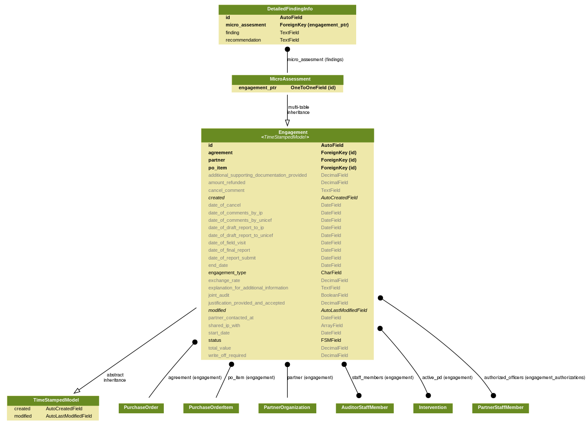
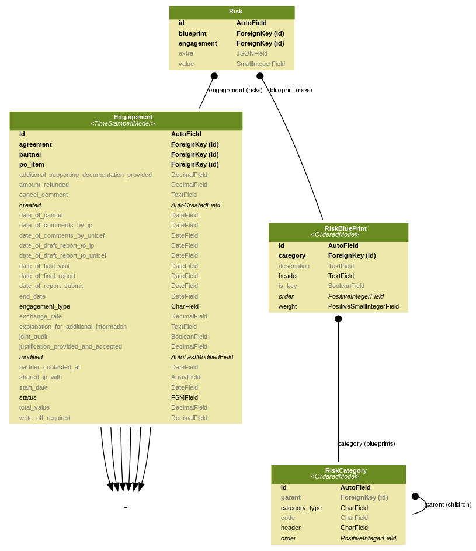
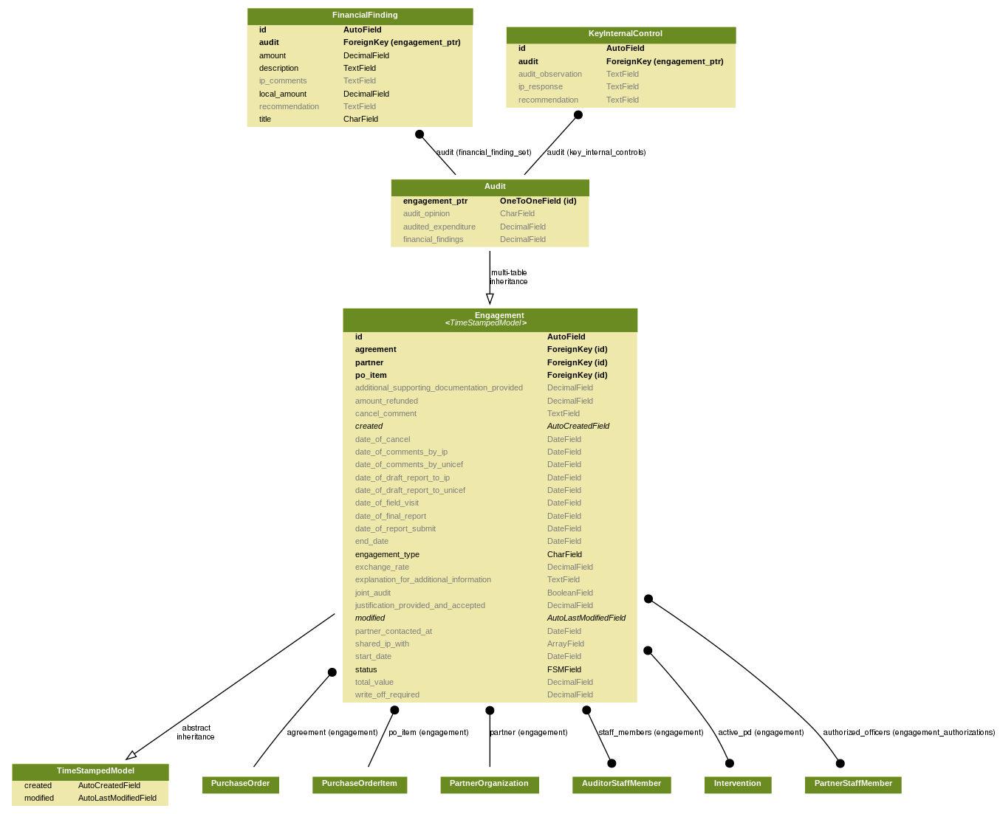
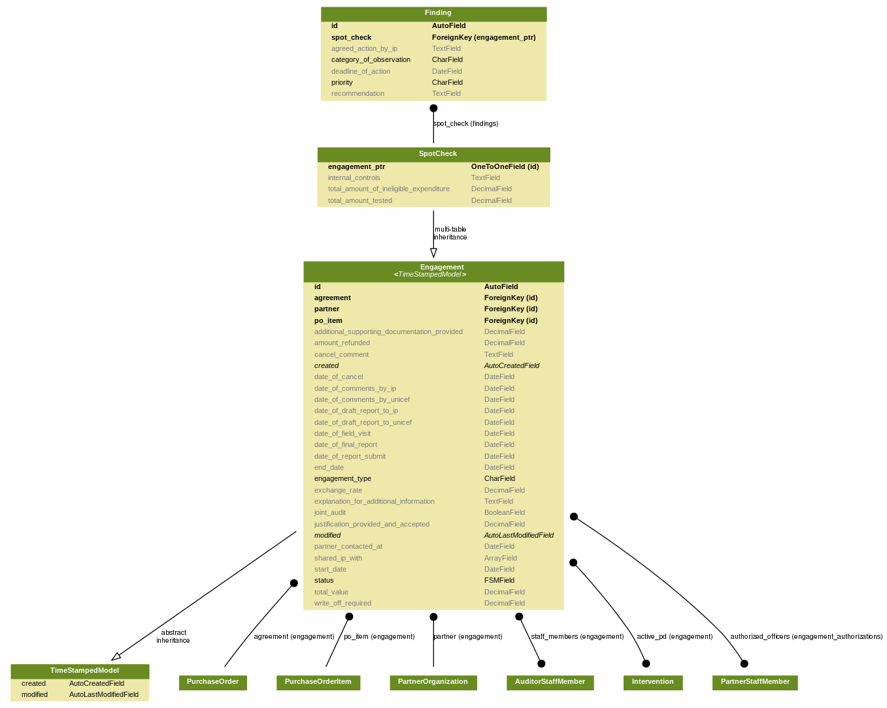
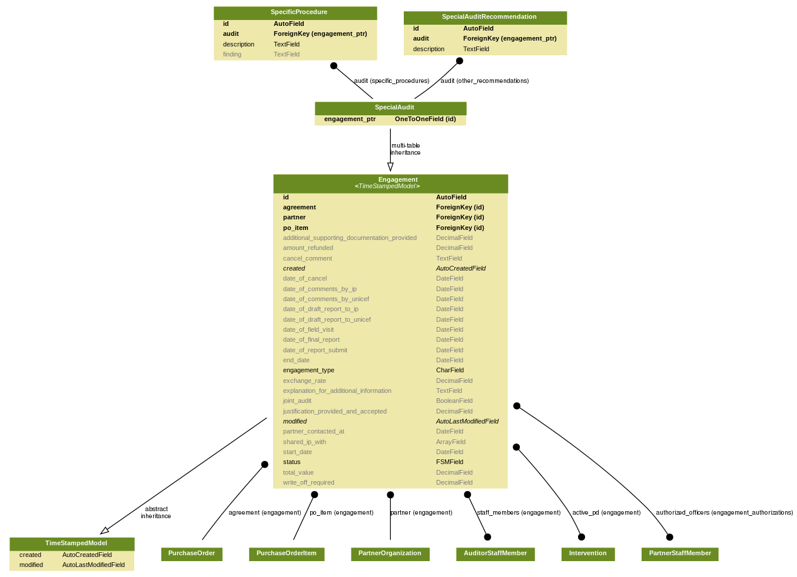
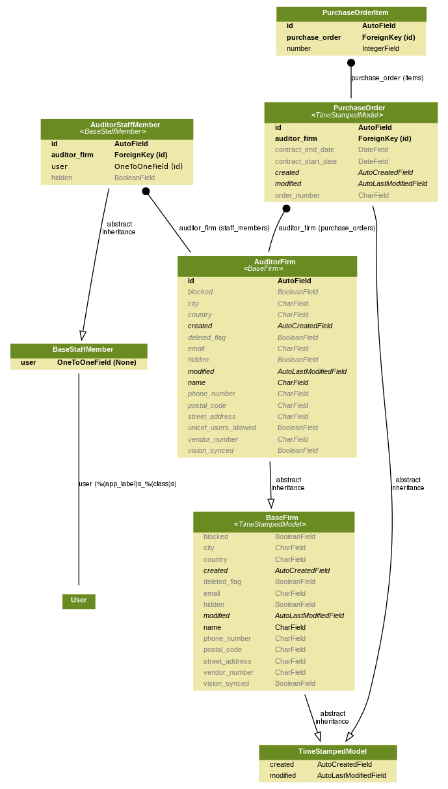
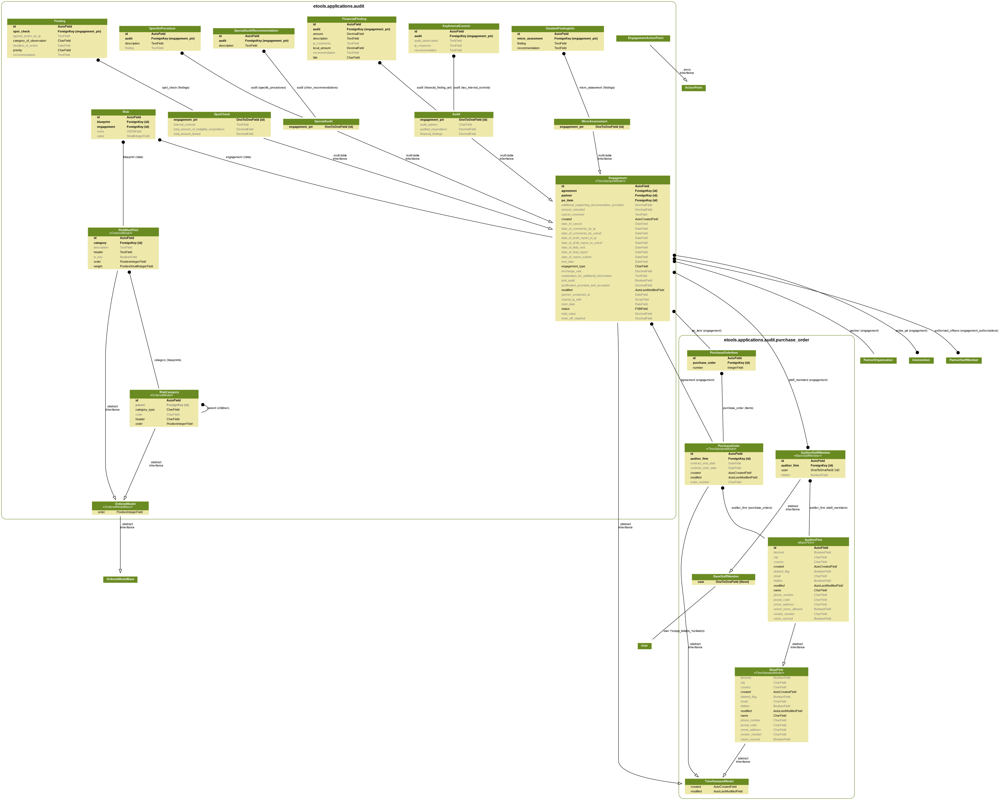

# Data Model

Main entity of Financial Assurance module is Engagement. It can be one of four types: Audit, SpecialAudit, SpotCheck, MicroAssessment. Each of them has own special fields & related models. They are stored inside tenants and doesn't share across the countries.

Main part of data contains in base Engagement model. Additionally to connected models, Risks are used to store Questionnaire, their structure is shown below. They describe answers to the questions \(RiskBluePrint\) from Questionnaire. Questions can be grouped using categories \(RiskCategory\). Category has link to self, so they are organized to tree.

Risks are used in audit too to store key weaknesses, they are flexible enough to store question-like structures.

Global models are base and can be shared across countries, namely partners & purchase orders.  
Tenant models are Engagement with it's subclasses and all models that relates to it.

Engagements are mapped to Purchase Orders. They were placed into single application because they are global and should be available from any country.

Purchase Orders are linked to Audit Firms, with their members.

Full models structure is shown on the scheme below.

